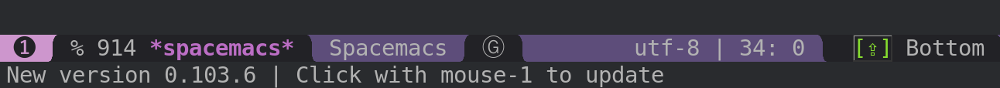

<a name="top" id="fork-destination-box"></a>
<a href="https://develop.spacemacs.org"><a href="https://www.gnu.org/licenses/gpl-3.0.en.html"></a></a><a href="https://www.twitter.com/spacemacs"></a><br>
- - -
<p align="center"></p>
<p align="center">
<b><a href="https://develop.spacemacs.org/doc/DOCUMENTATION#core-pillars">philosophy</a></b>
|
<b><a href="https://develop.spacemacs.org/doc/DOCUMENTATION#who-can-benefit-from-this">for whom?</a></b>
|
<b><a href="https://develop.spacemacs.org/doc/DOCUMENTATION#screenshots">screenshots</a></b>
|
<b><a href="https://develop.spacemacs.org/doc/DOCUMENTATION.html">documentation</a></b>
|
<b><a href="CONTRIBUTING.org">contribute</a></b>
|
<b><a href="https://develop.spacemacs.org/doc/DOCUMENTATION#achievements">achievements</a></b>
|
<b><a href="https://develop.spacemacs.org/doc/FAQ">FAQ</a></b>
</p>

- - -

<p align="center">
<a href="https://gitter.im/syl20bnr/spacemacs?utm_source=badge&utm_medium=badge&utm_campaign=pr-badge&utm_content=badge"></a>
<a href="https://github.com/syl20bnr/spacemacs/actions/workflows/elisp_test.yml"></a>
<a href="https://www.paypal.com/cgi-bin/webscr?cmd=_s-xclick&hosted_button_id=ESFVNPKP4Y742"></a>
<a href="https://shop.spreadshirt.com/spacemacs-shop"></a>
<a href="https://www.slant.co/topics/12/~what-are-the-best-programming-text-editors"></a>
</p>

- - -


**Quick Install:**

This assumes you don't have an existing Emacs setup and want to run Spacemacs as
your config. If you do have one, look at
the [full installation instructions](#install) for other options.

* For stable releases:
  ```shell
  git clone https://github.com/syl20bnr/spacemacs ~/.emacs.d
  ```

* For development updates and participation:
  ```shell
  git clone -b develop https://github.com/syl20bnr/spacemacs ~/.emacs.d
  ```
  * Windows Command Prompt:
    ```shell
    git clone -b develop https://github.com/syl20bnr/spacemacs %appdata%/.emacs.d
    ```

    Windows PowerShell:
    ```shell
    git clone -b develop https://github.com/syl20bnr/spacemacs $env:appdata/.emacs.d
    ```
<!-- markdown-toc start - Don't edit this section. Run M-x markdown-toc-refresh-toc -->
**Table of Contents**

- [Introduction](#introduction)
- [Features](#features)
- [Documentation](#documentation)
- [Getting Help](#getting-help)
- [Prerequisites](#prerequisites)
    - [Emacs](#emacs)
        - [Linux distros](#linux-distros)
        - [macOS](#macos)
            - [Install emacs](#install-emacs)
                - [Using emacs-plus](#using-emacs-plus)
                - [Using emacs-mac](#using-emacs-mac)
                - [Using cask](#using-cask)
                - [Other ways](#other-ways)
            - [Install Source Code Pro font](#install-source-code-pro-font)
            - [Install Spacemacs](#install-spacemacs)
        - [Windows](#windows)
            - [Install Spacemacs in Windows](#install-spacemacs-in-windows)
            - [Notes](#notes)
- [Install](#install)
    - [Default installation](#default-installation)
    - [Alternative installations](#alternative-installations)
        - [Modify HOME environment variable](#modify-home-environment-variable)
        - [Modify spacemacs-start-directory variable](#modify-spacemacs-start-directory-variable)
    - [Spacemacs logo](#spacemacs-logo)
- [Update](#update)
    - [Automatic update (on master branch)](#automatic-update-on-master-branch)
    - [Manual update (on master branch)](#manual-update-on-master-branch)
    - [On develop branch](#on-develop-branch)
    - [Revert to a specific version](#revert-to-a-specific-version)
- [Quotes](#quotes)
- [Contributions](#contributions)
- [Communities](#communities)
- [Spacemacs Everywhere](#spacemacs-everywhere)
- [License](#license)
- [Supporting Spacemacs](#supporting-spacemacs)

<!-- markdown-toc end -->

# Introduction
Spacemacs is a new way of experiencing Emacs -- it's a sophisticated and
polished set-up, focused on ergonomics, mnemonics and consistency.

Just clone and launch it, then press the space bar to explore the interactive
list of carefully-chosen key bindings. You can also press the home buffer's
`[?]` button for some great first key bindings to try.

Spacemacs can be used naturally by both Emacs and Vim users -- you can even mix
the two editing styles. Being able to quickly switch between input styles, makes
Spacemacs a great tool for pair-programming.

Spacemacs is currently in beta, and any contributions are very welcome.


# Features
- **Great documentation:** access the Spacemacs documentation with
<kbd>SPC h SPC</kbd>.
- **Beautiful GUI:** you'll love the distraction free UI and its functional
mode-line.
- **Excellent ergonomics:** all the key bindings are accessible by pressing the
<kbd>space bar</kbd> or <kbd>alt-m</kbd>.
- **Mnemonic key bindings:** commands have mnemonic prefixes like
<kbd>SPC b</kbd> for all the buffer commands or <kbd>SPC p</kbd> for the project
commands.
- **Batteries included:** discover hundreds of ready-to-use packages nicely
organised in configuration layers following a set of
[conventions][CONVENTIONS.org].

# Documentation
Comprehensive documentation is available for each layer by pressing
<kbd>SPC h SPC</kbd>.

You can also check the [general documentation][DOCUMENTATION.org],
[quick start guide][QUICK_START.org] and the [FAQ][FAQ.org].

# Getting Help
If you need help, ask your question in the [Gitter Chat][] and a member of the
community will help you out.

If you prefer IRC, connect to the [Gitter Chat IRC server][] and join the
`#syl20bnr/spacemacs` channel.

Last but not least there are a lot of high class tutorials available on YouTube:
* Jack of Some's Spacemacs related channel [here](https://www.youtube.com/watch?v=r-BHx7VNX5s&list=PLd_Oyt6lAQ8Rxb0HUnGbRrn6R4Cdt2yoI)
* GDQuest's Game Design oriented tutorials to Spacemacs [here](https://www.youtube.com/watch?v=hCNOB5jjtmc&list=PLhqJJNjsQ7KFkMVBunWWzFD8SlH714qm4)
* Practicalli's Clojure tutorials based on Spacemacs [here](https://www.youtube.com/watch?v=ZKuQDrQLAnc&list=PLpr9V-R8ZxiCHMl2_dn1Fovcd34Oz45su)
* Eivind Fonn's classic Spacemacs ABC [here](https://www.youtube.com/watch?v=ZFV5EqpZ6_s&list=PLrJ2YN5y27KLhd3yNs2dR8_inqtEiEweE)

# Prerequisites
Spacemacs is an extension of a popular text editor called Emacs. Thus you need
to first install base Emacs and then download the Spacemacs extension files with
Git.

## Emacs
Spacemacs requires Emacs 25.1 or above. The development version of Emacs is not
*officially* supported, but it should nevertheless be expected to work.

Some modes require third-party tools that you'll have to install via your
favorite package manager.

### Linux distros
Install the `emacs` package with your linux distributions package manager.

Do not install the `xemacs` package. It's not supported by Spacemacs. XEmacs is
an old fork of Emacs. The X in its name is unrelated to X11.

Emacs has graphical support.

**Note:** The Ubuntu LTS 12.04 and 14.04 repositories only have Emacs version
24.3 available. Version 25.1 or greater needs to be [built from source][build_source].
This might also be true for other linux distributions.

### macOS

#### Install emacs

##### Using emacs-plus

```
brew tap d12frosted/emacs-plus
# to install Emacs 26
brew install emacs-plus
# or to install Emacs 27
brew install emacs-plus@27 --with-spacemacs-icon
# or to install Emacs 28
brew install emacs-plus@28 --with-spacemacs-icon
brew link emacs-plus
```

##### Using emacs-mac

```
brew tap railwaycat/emacsmacport
brew install emacs-mac
brew link emacs-mac
```

##### Using cask

Homebrew now recommends to use the cask version with the following message:
"Please try the Cask for a better-supported Cocoa version". To install the cask
version:

```
brew install --cask emacs
```

or in older versions of homebrew

```
brew cask install emacs
```

This installs a pre-built package from https://emacsformacosx.com/

##### Other ways

If you're not comfortable with the ways mentioned above, then
[EmacsWiki](https://www.emacswiki.org/emacs/EmacsForMacOS#toc12) lists down
a few ways to install Emacs for macOS.

#### Install Source Code Pro font

Once Emacs is installed, run the following commands in the terminal to install
the default Source Code Pro font:

```sh
brew tap homebrew/cask-fonts
brew install --cask font-source-code-pro
```

or in older versions of homebrew

```
brew tap homebrew/cask-fonts
brew cask install font-source-code-pro
```

#### Install Spacemacs

```
git clone https://github.com/syl20bnr/spacemacs ~/.emacs.d
```

**Notes:**
After completing the Spacemacs [install process](#install), then it's also
recommended to add the [osx layer][] to your [dotfile][]. Installation
instructions are available in the documentation for the [osx layer][].

Depending on the installed version of GnuTLS securely installing emacs
packages may fail. In this case it is possible to install using
`emacs --insecure`. However be aware that this means your packages will
be transferred using http, use at your own risk.

You might also have some issues when doing some search on your projects, you
probably want to install grep through homebrew with default names:

```sh
$ brew install grep --with-default-names
```

### Windows
Download the official 64-bit (x86_64) stable builds from the [GNU FTP][emacs-for-windows].

You'll also need `gzip` and put it in your path, to download it go to the
[GNUWin32 project page][gzip-for-windows]

#### Install Spacemacs in Windows
By default Emacs looks for the `.emacs.d` directory in:
`C:\Users\<username>\AppData\Roaming`

* Clone Spacemacs to the Roaming directory:
  * Windows Command Prompt
    ```shell
    git clone -b develop https://github.com/syl20bnr/spacemacs %appdata%/.emacs.d
    ```

  * Windows PowerShell prompt:
    ```shell
    git clone -b develop https://github.com/syl20bnr/spacemacs $env:appdata/.emacs.d
    ```

* Or if a `HOME` environment variable has been configured, that points to your
user directory: `C:\Users\<username>`

  Clone Spacemacs to the `<username>` directory:
  * Windows Command Prompt
    ```shell
    git clone -b develop https://github.com/syl20bnr/spacemacs %homepath%/.emacs.d
    ```

  * Windows PowerShell prompt:
    ```shell
    git clone -b develop https://github.com/syl20bnr/spacemacs $home/.emacs.d
    ```

#### Notes

* If the following error occurs after starting Emacs:

  ```
  The directory ~/.emacs.d/server is unsafe
  ```

  Fix it by changing the owner of the directory `~/.emacs.d/server`:
    - from Properties select the Tab “Security”,
    - select the button “Advanced”,
    - select the Tab “Owner”
    - change the owner to your account name

  Source: [Stack Overflow][so-server-unsafe]

* For efficient searches we recommend installing `pt` ([the platinum searcher][]).
`pt` version 1.7.7 or higher is required.

* Depending on the installed version of GnuTLS securely installing emacs
packages may fail. In this case it is possible to install using
`emacs --insecure`. However be aware that this means your packages will
be transferred using http, use at your own risk.

* The period (dot) before a file or folder name, means that it's hidden.
  To show hidden files and folders:
  - Press the Windows key
  - Type `file explorer options`
  - Select the `View` tab at the top
  - Check `Show hidden files, folders and drives`
  - Click `OK`

# Install
## Default installation
1. If you have an existing Emacs configuration, back it up first by running the
   following code in your terminal:

   ```sh
   cd ~
   mv .emacs.d .emacs.d.bak
   mv .emacs .emacs.bak
   ```

   Don't forget to backup and *remove* the `~/.emacs` file. Otherwise Spacemacs
   **WILL NOT** be able to load. Because that file prevents Emacs from loading
   the proper initialization file.

2. Clone the repository with [Git][]:

   **Note: Windows users**, see the [Windows section](#install-spacemacs-in-windows) for the correct clone path.

   ```sh
   git clone https://github.com/syl20bnr/spacemacs ~/.emacs.d
   ```

   Or

   ```sh
   git clone --depth 1 https://github.com/syl20bnr/spacemacs ~/.emacs.d
   ```

   In case you have a limited internet connection or speed.

   `master` is the stable branch and it is _immutable_, **DO NOT** make any
   modification to it or you will break the update mechanism. If you want to
   fork Spacemacs safely, use the `develop` branch where you'll handle updates
   manually.

3. (Optional) Install the default fonts

   It's recommended to install [Source Code Pro][] by Adobe, as the default
   font. It ensures that, for example the symbols on the modeline (bottom bar)
   looks correct. It's also recommended to use a "Fallback font". These
   depend on the system:

   - GNU/Linux: *NanumGothic* (package named *fonts-nanum* on Debian, for
     example)
   - macOS: *Arial Unicode MS*
   - Windows: *MS Gothic* or *Lucida Sans Unicode*

   If the modeline doesn't look similar to the
   [picture at the top of this page](#introduction), then make sure you have the
   correct fallback font installed.

   If you're running in a terminal then you'll also need to change the terminals
   font settings.

4. Launch Emacs. Spacemacs will automatically install the packages it requires.
   There is a well-known issue with some GPG keys having expired end of 2019.
   This can be fixed by upgrading to Emacs 26.3 or above or by manually adding
   the new keys using something like:
   ```sh
   gpg --homedir ~/.emacs.d/elpa/gnupg --receive-keys 066DAFCB81E42C40
   ```
   If you have a restrictive firewall it may help to manually specify the keyserver:
   ```sh
   gpg --keyserver keyserver.ubuntu.com --homedir ~/.emacs.d/elpa/gnupg/ --receive-keys 066DAFCB81E42C40
   ```

5. Launch Emacs, and answer the questions in the Dotfile wizard installer. If
   you are new to Emacs and Spacemacs, then it's fine to just accept the default
   choices. It's easy to try the other choices later, without having to
   reinstall Spacemacs. They can be changed in the dotfile `~/.spacemacs`.

   After answering the questions, then Spacemacs starts downloading and
   installing the packages it requires. When the packages have been installed.
   Restart Emacs to complete the installation.

**Notes:**
If you are behind a firewall or similar and you get an error regarding package
downloads then you may try to disable the HTTPS protocol by starting Emacs with
```sh
emacs --insecure
```
but this should be a last resort because of the security implications.

You can set the `dotspacemacs-elpa-https` variable to `nil` in your
dotfile `~/.spacemacs` but this has the same security implications as the
insecure flag. You may also want to clear out your `.emacs.d/elpa`
directory before doing this, so that any corrupted packages you may have
downloaded will be re-installed.

`error: Package 'package-build-' is unavailable` may occur due to heavy network
taffic. You can fix it by setting the `dotspacemacs-elpa-timeout` variable to
`70` in your dotfile.

`Warning (bytecomp)` and other compilation warnings are perfectly normal. If
you're curious, you can find out why these occur [here][compilation-warnings].

If the mode-line turns red then be sure to consult the [FAQ][FAQ.org].

## Alternative installations
There are currently, two supported, alternative locations, for a Spacemacs
configuration.

### Modify HOME environment variable
This solution is ideal for quickly trying Spacemacs without compromising your
existing configuration. Clone Spacemacs outside the Emacs dotdirectory
`~/.emacs.d` and modify the HOME environment variable.

```sh
mkdir ~/spacemacs
git clone https://github.com/syl20bnr/spacemacs.git ~/spacemacs/.emacs.d
HOME=~/spacemacs emacs
```

Note: If you're using the Fish shell, then you'll need to modify the last
command to: `env HOME=$HOME/spacemacs emacs`

### Modify spacemacs-start-directory variable
This solution is better suited to "embed" Spacemacs into your own configuration.
If you've cloned Spacemacs into `~/.emacs.d/spacemacs/`, then drop the following
lines in the `~/.emacs.d/init.el` file:

```elisp
(setq spacemacs-start-directory "~/.emacs.d/spacemacs/")
(load-file (concat spacemacs-start-directory "init.el"))
```

## Spacemacs logo
For Linux users, create `spacemacs.desktop` in `~/.local/share/applications/` using [this](https://github.com/emacs-mirror/emacs/blob/master/etc/emacs.desktop) as a reference. Change the `Name` parameter to `Name=Spacemacs` and the `Icon` parameter to `Icon=/PATH/TO/EMACSD/core/banners/img/spacemacs.png` where `PATH/TO/EMACSD` is the path to your `.emacs.d` directory, usually `~/.emacs.d` or `~/.config/emacs`.

For macOS users, you need to [download the .icns version of the logo][icon-repository],
then [change the logo on the Dock][icon-mac-instructions].

# Update
Spacemacs shows a notification when a new version is available (only when you
are on the default `master` branch). If you are on the `develop` branch then
you'll have to update the Spacemacs repository manually.

## Automatic update (on master branch)
When a new version is available then a little arrow appears in the mode-line.

Its color depends on the number of versions that have been released since your
last update. Green means that you have a recent version, orange and red means
that you have an older version.



Click on the arrow to update Spacemacs to the latest version.

## Manual update (on master branch)
Remove the `<` and `>` angle brackets when you're typing the lines below into
your shell. And replace the text: "tag version which you are updating to" with a
tagged version. This page lists the [latest tags][]

```sh
git fetch
git reset --hard <tag version which you are updating to>
```

## On develop branch
1. Close Emacs and update the git repository:

   ```sh
   git pull --rebase
   ```

2. Restart Emacs to complete the upgrade.

## Revert to a specific version
To revert to a specific version, just checkout the corresponding branch. For
instance to revert to version `0.200`, type the following command:

   ```sh
   git checkout origin/release-0.200
   ```

**After updating Spacemacs (either manually or automatically), then you also
should check if any updates are available for your packages. On the Spacemacs
Home Buffer `SPC b h`, click (press `RET`) on the `[Update Packages]` button.**

# Quotes
[Quote][quote01] by [ashnur](https://github.com/ashnur):

    «I feel that spacemacs is an aircraft carrier and I am playing table tennis
    on the deck as a freerider.»

[Quote][quote02] by [deuill](https://github.com/deuill):

    «I LOVE SPACEMACS AND MAGIT

     That is all»

# Contributions
Spacemacs is a community-driven project, it needs _you_ to keep it up to date
and to propose great and useful configurations for all the things!

Before contributing be sure to consult the
[contribution guidelines][CONTRIBUTING.org] and [conventions][CONVENTIONS.org].

# Communities
- [Gitter Chat]
- [Stack Exchange]
- [Reddit]

# Spacemacs Everywhere

Once you've learned the Spacemacs key bindings, you can use them in other IDEs/tools, thanks to the following projects:
- [Intellimacs](https://github.com/MarcoIeni/intellimacs) - Spacemacs' like key bindings for IntelliJ platform
- [Spaceclipse](https://github.com/MarcoIeni/spaceclipse) - Spacemacs’ like key bindings for Eclipse
- [SpaceVim](https://github.com/SpaceVim/SpaceVim) - A community-driven modular vim distribution
- [VSpaceCode](https://github.com/VSpaceCode/VSpaceCode) - Spacemacs’ like key bindings for Visual Studio Code

# License
The license is GPLv3 for all parts specific to Spacemacs, this includes:
- the initialization and core files
- all the layer files
- the documentation

For the packages shipped in this repository, you can refer to the files header.

[Spacemacs logo][] by [Nasser Alshammari][] released under a
[Creative Commons Attribution-ShareAlike 4.0 International License.](https://creativecommons.org/licenses/by-sa/4.0/)

# Supporting Spacemacs
The best way to support Spacemacs is to contribute to it either by reporting
bugs, helping the community on the [Gitter Chat][] or sending pull requests.

You can show your love for the project by getting cool Spacemacs t-shirts, mugs
and more in the [Spacemacs Shop][].

If you want to show your support financially, then you can contribute to
[Bountysource][], or buy a drink for the maintainer by clicking on the
[Paypal badge](#top).

If you used spacemacs in a project, and you want to show that fact, you can use
the spacemacs badge: [](https://develop.spacemacs.org)

- For Markdown:

   ```markdown
   [](https://develop.spacemacs.org)
   ```

- For HTML:

   ```html
   <a href="https://develop.spacemacs.org"></a>
   ```

- For Org-mode:

   ```org
   [[https://develop.spacemacs.org][file:https://cdn.rawgit.com/syl20bnr/spacemacs/442d025779da2f62fc86c2082703697714db6514/assets/spacemacs-badge.svg]]
   ```

Thank you!

[Twitter]: https://i.imgur.com/tXSoThF.png
[CONTRIBUTING.org]: CONTRIBUTING.org
[CONVENTIONS.org]: https://develop.spacemacs.org/doc/CONVENTIONS
[DOCUMENTATION.org]: https://develop.spacemacs.org/doc/DOCUMENTATION
[QUICK_START.org]: https://develop.spacemacs.org/doc/QUICK_START
[FAQ.org]: https://develop.spacemacs.org/doc/FAQ
[VIMUSERS.org]: https://develop.spacemacs.org/doc/VIMUSERS
[dotfile]: https://develop.spacemacs.org/doc/DOCUMENTATION#dotfile-configuration
[osx layer]: https://develop.spacemacs.org/layers/+os/osx/README.html
[Gitter Chat]: https://gitter.im/syl20bnr/spacemacs
[Gitter Chat IRC server]: https://irc.gitter.im/
[Homebrew]: https://brew.sh
[emacs-plus]: https://github.com/d12frosted/homebrew-emacs-plus
[powerline documentation]: https://develop.spacemacs.org/doc/DOCUMENTATION.html#powerline-separators
[emacs-for-windows]: https://ftp.gnu.org/gnu/emacs/windows/
[gzip-for-windows]: http://gnuwin32.sourceforge.net/packages/gzip.htm
[the platinum searcher]: https://github.com/monochromegane/the_platinum_searcher
[so-server-unsafe]: https://stackoverflow.com/questions/885793/emacs-error-when-calling-server-start
[Spacemacs logo]: https://github.com/nashamri/spacemacs-logo
[Nasser Alshammari]: https://github.com/nashamri
[compilation-warnings]: https://github.com/quelpa/quelpa/issues/90#issuecomment-137982713
[cpaulik-unity-icon]: http://splendidabacus.com/posts/2015/03/spacemacs-unity-icon/
[icon-mac-instructions]: https://www.idownloadblog.com/2014/07/16/how-to-change-app-icon-mac/
[latest tags]: https://github.com/syl20bnr/spacemacs/tags
[icon-repository]: https://github.com/nashamri/spacemacs-logo
[Stack Exchange]: https://emacs.stackexchange.com/questions/tagged/spacemacs
[Reddit]: https://www.reddit.com/r/spacemacs
[quote01]: https://gitter.im/syl20bnr/spacemacs?at=568e627a0cdaaa62045a7df6
[quote02]: https://gitter.im/syl20bnr/spacemacs?at=5768456c6577f032450cfedb
[build_source]: https://www.gnu.org/software/emacs/manual/html_node/efaq/Installing-Emacs.html
[Bountysource]: https://salt.bountysource.com/teams/spacemacs
[Source Code Pro]: https://github.com/adobe-fonts/source-code-pro
[Spacemacs Shop]: https://shop.spreadshirt.com/spacemacs-shop
[Git]: https://git-scm.com/downloads
