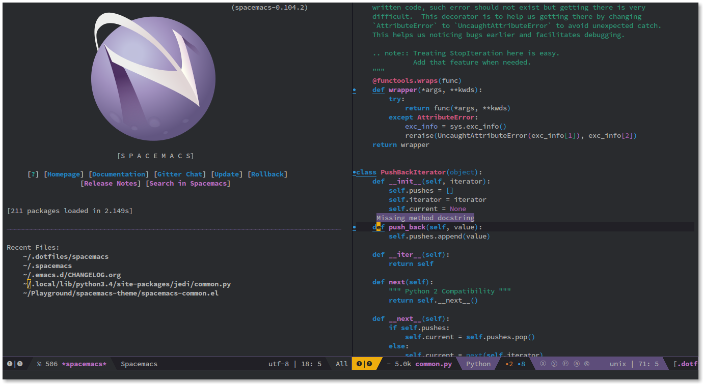

***

[philosophy][] | [goals][] | [for who?][] | [screenshots][] | [documentation][DOCUMENTATION.md] | [contribute][CONTRIBUTE.md] | [achievements][] | [FAQ][]
***
[](https://travis-ci.org/syl20bnr/spacemacs) [](https://gitter.im/syl20bnr/spacemacs?utm_source=badge&utm_medium=badge&utm_campaign=pr-badge&utm_content=badge)[![Twitter][]](http://www.twitter.com/spacemacs)
***

**Quick Install:**

    git clone --recursive http://github.com/syl20bnr/spacemacs ~/.emacs.d

<!-- markdown-toc start - Don't edit this section. Run M-x markdown-toc/generate-toc again -->
**Table of Contents**

- [Introduction](#introduction)
- [Features](#features)
    - [Batteries Included](#batteries-included)
    - [Nice UI](#nice-ui)
    - [Excellent Evil Support](#excellent-evil-support)
    - [Convenient and Mnemonic Key Bindings](#convenient-and-mnemonic-key-bindings)
        - [Great [Documentation][DOCUMENTATION.MD]](#great-documentationdocumentationmd)
- [Prerequisites](#prerequisites)
    - [Emacs version](#emacs-version)
    - [OS X](#os-x)
- [Install](#install)
- [Update](#update)
    - [Update notification](#update-notification)
- [Configuration](#configuration)
    - [Configuration layers](#configuration-layers)
    - [Dotfile (.spacemacs)](#dotfile-spacemacs)
- [Learning Spacemacs](#learning-spacemacs)
    - [Evil-tutor](#evil-tutor)
    - [The leader key](#the-leader-key)
    - [Universal argument](#universal-argument)
    - [Configuration layers and Packages discovery](#configuration-layers-and-packages-discovery)
    - [Key bindings discovery](#key-bindings-discovery)
    - [Describe functions](#describe-functions)
- [Contributions](#contributions)
- [FAQ](#faq)
    - [Common](#common)
    - [Windows](#windows)
    - [OS X](#os-x)

<!-- markdown-toc end -->

# Introduction

`Spacemacs` is a user-friendly and well-documented Emacs kit that integrates the
best Emacs packages out there. It uses [Evil Mode][] to combine the ergonomic
editing features of Vim with the extensibility of Emacs.

Spacemacs is designed to be approachable to users coming from Vim--you do not
need any prior experience with Emacs to get started.

If you are already an experienced Emacs user, you will appreciate the clean
customization system and tight integration of the included packages.

Spacemacs is currently in beta, and contributions are welcome.

# Features

## Batteries Included

Spacemacs integrates hundreds of packages and is ready to use with no additional
configuration. It provides excellent support for many languages, including the
following:

- [Elixir][]
- [Haskell][]
- [JavaScript][]
- LaTex
- [Python][]
- [R][]
- [Ruby][]
- SCSS
- [Scala][]
- [Clojure][]
- [C-C++][]

It also comes with [Git support][] and [project management][] tools. All these
features are loaded on-demand to keep startup time short.

The Spacemacs community provides [additional configurations][contrib layers]
that extend the default distribution.

**[Visit the Documentation][DOCUMENTATION.MD]**

## Nice UI

Spacemacs looks good. It comes with high-quality themes and a custom low-clutter
modeline.



## Excellent Evil Support

Spacemacs is designed around Vim keyboard bindings, provided by [Evil Mode][].
The packages distributed with Spacemacs are customized to integrate seamlessly
with Evil.

Spacemacs improves upon Vim by using task-specific states to group related
commands. These states reduce the keystrokes needed to issue repetitive commands
and reduce the number of keyboard bindings to learn.

## Convenient and Mnemonic Key Bindings

`Spacemacs` organizes key bindings into mnemonic groups. For example, commands
to operate on the buffer are prefixed by `<SPC> b`, and commands to operate on
the project are under `<SPC> p`.

There is no need to learn convoluted Emacs key chords--Spacemacs uses memorable
bindings that are easy to type.

### Great [Documentation][DOCUMENTATION.MD]

Most of Spacemacs' features are extensively documented, along with key bindings
and configuration options.

If you need help, ask your question in the [Gitter Chat][] and a member of the
community will help you out.

# Prerequisites

## Emacs version

`Spacemacs` is tested with Emacs 24.3 and 24.4. It should boot on all the major
OSes where these versions can be installed.

Some modes require third-party tools that you'll have to install via your
favorite package manager.

## OS X

The recommended version for OS X is [emacs-mac-port][]. It can be installed
from [homebrew][] with the following commands:

```sh
$ brew tap railwaycat/emacsmacport
$ brew install emacs-mac
```

The default key handling is different from the official OS X port. To correct
this you can add the [osx layer][] to your [dotfile][] layer list:

```elisp
(setq-default dotspacemacs-configuration-layers '(osx))
```

Note that the `emacs-mac-port` server behaves differently than the regular
Emacs server.
Details can be found on the emacs-mac-port [README][emacs-mac-port-server].

# Install

1. If you have an existing Emacs configuration, back it up:

   ```sh
   cd ~
   mv .emacs.d .emacs.bak
   ```

2. Clone this repository _with its submodules_:

   ```sh
   git clone --recursive http://github.com/syl20bnr/spacemacs ~/.emacs.d
   ```

   `master` is the stable branch and is regularly updated. Switch to the `develop`
   branch if you want to use the bleeding-edge version.

3. Launch Emacs. Spacemacs will automatically install the packages it requires.

4. Restart Emacs to complete the installation.

See the [troubleshooting][troubleshoot] guide if you have any issues.

# Update

Spacemacs currently requires manual updates using the following procedure:

1. Update Emacs packages.
  1. Open the package list using `<SPC> a P` or `M-x paradox-list-packages`
  2. Mark all packages for updating by pressing `U`, and
  3. install them with `x`.

  [See the documentation][using_package_buf] for more information about how to use
  the package list.

2. Close Emacs and update the git repository:

   ```sh
   git pull --rebase
   git submodule sync; git submodule update
   ```

3. Restart Emacs to complete the upgrade.

## Update notification

For convenience an indicator is displayed in the mode-line whenever a new
version of `Spacemacs` is available.

           Symbol                     | Description
:------------------------------------:|----------------------------------
  | less than 3 releases behind
 | less than 5 releases behind
    | 5 or more releases behind

**Note:**
Update of `Spacemacs` by clicking on the indicator will be implemented _soon_.

# Configuration

`Spacemacs` divides its configuration into self-contained units called
[configuration layers][config]. It uses a dotfile, `~/.spacemacs`, to control
which of these features to enable.

## Configuration layers

A configuration layer is a directory containing at least the following files:

- `packages.el`: Defines and configures packages to be downloaded from Emacs package repositories
- `extensions.el`: Configures packages that do not need to be downloaded with
  the package manager, such as built-in Emacs features and git submodules.

You should create your own configuration layers in the [private][] directory.
The following command automates this process:

    <SPC> : configuration-layer/create-layer RET

_Caveat:_ For your privacy, the contents of the `private` directory are not
under source control. See the documentation for a discussion on how to
[manage your private configuration][manage_config].

Any configuration layers you create must be explicitly loaded in your
`~/.spacemacs` file.

## Dotfile (.spacemacs)

The `.spacemacs` file controls which features to load and provides a way to
customize Spacemacs.

The following command will create `.spacemacs` in your home directory:

    <SPC> : dotspacemacs/install RET

To open the installed dotfile:

    <SPC> f e d

To load configuration layers, add them to the list beside
`dotspacemacs-configuration-layers`:

```lisp
;; List of configuration layers to load.
dotspacemacs-configuration-layers '(company-mode smex)
```

The comments in this file contain further information about how to customize
Spacemacs. See the [dotfile configuration][dotfile] section of the documentation
for more information.

# Learning Spacemacs

## Evil-tutor

Press <kbd>SPC h T</kbd> to start the Vimtutor adapted for Evil.

## The leader key

Spacemacs key bindings use a leader key which is set by default to
<kbd>SPC</kbd> key (space bar).

You can change it easily by setting the variable `dotspacemacs-leader-key` in
your `~/.spacemacs` file.

## Universal argument

In spacemacs the universal argument is by default on `<SPC> u` instead of `C-u`
which is used to scroll up as in Vim.

## Configuration layers and Packages discovery

By using `helm-spacemacs` with <kbd>SPC f e h</kbd> you can quickly search
for a package and get the name of the layers using it.

You can also easily go to the `README.md` of a layer or go to the initialization
function of a package.

## Key bindings discovery

Thanks to [guide-key][], whenever a prefix command is pressed (like `<SPC>`)
a buffer appears after one second listing the possible keys for this prefix.

It is also possible to search for specific key bindings by pressing:

    <SPC> ?

To narrow the list to `Spacemacs` key bindings starting with prefix `<SPC>`,
set the pattern to something like the regular expression:

    SPC\ b

The example above will list all the `buffer` related bindings.

## Describe functions

`Describe functions` are powerful Emacs introspection commands to get information
about functions, variables, modes and so on.

These functions are accessible with the following bindings:

Key Binding   |                 Description
--------------|------------------------------------------------------------------
`<SPC> h d f` | describe-function
`<SPC> h d k` | describe-key
`<SPC> h d m` | describe-mode
`<SPC> h d v` | describe-variable

# Contributions

`Spacemacs` needs you!

Especially to grow the number of configuration layers, for instance to support new languages.

If you are ready to contribute please consult the [contribution guidelines][CONTRIBUTE.md]
first.

# FAQ

## Common

1. **Which version of Spacemacs am I running ?**
The version is displayed on the upper right corner of the loading screen. It
is also possible to display the version with <kbd>SPC f e v</kbd>.

2. **Why installed packages with package-install are automatically deleted by
Spacemacs when it starts ?**
To declare new packages you have to create a new configuration layer, see
the quick start guide [here](#configuration).

3. **The Spacemacs banner is ugly, what should I do ?**
Install the default font supported by Spacemacs or choose a fixed witdh font.
More information in the [font section][] of the documentation.

4. **Why the powerline has no arrows in terminal even with a patched font ?**
Emacs powerline implementation does not use patched fonts. There exist currently
no mode-lines in Emacs that support patched font.
The corresponding feature request for the powerline can be found
[here][pw-patched-fonts].

5. **The powerline separators have no anti-aliasing, what can I do ?**
Emacs powerline uses XMP images to draw the separators. Enabling anti-aliasing
may not be a trivial task so unfortunately you'll have to live with it.
Nevertheless it exists a [large number of different separators][powerline-seps]
and you can try to setup a different one with less aliasing (arrows for
instance), alternatively you can disable them (note that the tilde characters
on buffer empty lines have the same limitations).

## Windows

1. **Why the fonts on Windows looks so crappy ?**
You can install [MacType][] on Windows to get very nice looking fonts. It is
also recommended to disable the smooth scrolling on Windows.

2. **How to fix the error: The directory ~/.emacs.d/server is unsafe ?**
Change the owner of the directory `~/.emacs.d/server`:
- from Properties select the Tab “Security”,
- select the button “Advanced”,
- select the Tab “Owner”
- change the owner to your account name
Source: [Stackoverflow][so-server-unsafe]

## OS X

1. **Why the powerline colors are not correct on OS X ?**
This is a [known issue][powerline-srgb-issue] as of Emacs 24.4 due to
`ns-use-srgb-colorspace` defaulting to true. It is recommended to use
the [emacs-mac-port][] build. See the [install OSX section][] for more
info on this.

[Twitter]: http://i.imgur.com/tXSoThF.png
[philosophy]: doc/DOCUMENTATION.md#philosophy
[goals]: doc/DOCUMENTATION.md#goals
[for who?]: doc/DOCUMENTATION.md#who-can-benefit-from-this-
[screenshots]: doc/DOCUMENTATION.md#screenshots
[config]: doc/DOCUMENTATION.md#configuration-layers
[dotfile]: doc/DOCUMENTATION.md#dotfile-configuration
[manage_config]: doc/DOCUMENTATION.md#managing-private-configuration-layers
[using_package_buf]: doc/DOCUMENTATION.md#using-the-package-list-buffer
[achievements]: doc/DOCUMENTATION.md#achievements
[troubleshoot]: doc/DOCUMENTATION.md#troubleshoot
[contrib layers]: doc/DOCUMENTATION.md#using-configuration-layers
[Git support]: contrib/git/README.md
[ace-jump]: doc/DOCUMENTATION.md#vim-motions-with-ace-jump-mode
[project management]: doc/DOCUMENTATION.md#project-management
[Evil Mode]: doc/DOCUMENTATION.md#evil
[private]: https://github.com/syl20bnr/spacemacs/tree/master/private
[DOCUMENTATION.md]: doc/DOCUMENTATION.md
[font section]: doc/DOCUMENTATION.md#font
[CONTRIBUTE.md]: doc/CONTRIBUTE.md
[powerline-seps]: doc/DOCUMENTATION.md#powerline-separators
[FAQ]: https://github.com/syl20bnr/spacemacs#faq
[dotfile]: https://github.com/syl20bnr/spacemacs#dotfile-spacemacs
[install OSX section]: https://github.com/syl20bnr/spacemacs#os-x
[osx layer]: contrib/osx/README.md
[guide-key]: https://github.com/kai2nenobu/guide-key
[guide-key-tip]: https://github.com/aki2o/guide-key-tip
[evil-nerd-commenter]: https://github.com/redguardtoo/evil-nerd-commenter
[Gitter Chat]: https://gitter.im/syl20bnr/spacemacs
[pw-patched-fonts]: https://github.com/milkypostman/powerline/issues/15
[MacType]: https://code.google.com/p/mactype/
[emacs-mac-port]: https://github.com/railwaycat/emacs-mac-port
[emacs-mac-port-server]: https://github.com/railwaycat/emacs-mac-port/blob/master/README-mac#L210-L213
[homebrew]: https://github.com/Homebrew/homebrew
[Elixir]: contrib/lang/erlang-elixir
[Haskell]: contrib/lang/haskell
[JavaScript]: contrib/lang/javascript
[Python]: contrib/lang/python
[R]: contrib/lang/ess
[Ruby]: contrib/lang/ruby
[Scala]: contrib/lang/scala
[Clojure]: contrib/lang/clojure
[C-C++]: contrib/lang/c-c++
[powerline-srgb-issue]: https://github.com/milkypostman/powerline/issues/54
[so-server-unsafe]: http://stackoverflow.com/questions/885793/emacs-error-when-calling-server-start
