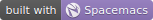
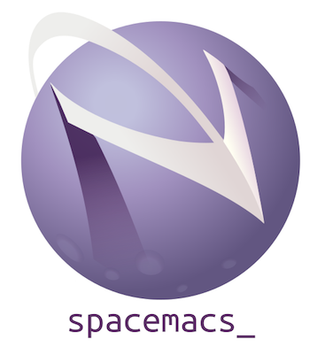

<a name="top" id="fork-destination-box"></a>
<a href="https://develop.spacemacs.org"></a>
<a href="https://www.gnu.org/licenses/gpl-3.0.en.html"></a>
<a href="https://www.twitter.com/spacemacs"></a>

<!-- logo and links -->
<p align="center"></p>
<p align="center">
<b><a href="https://develop.spacemacs.org/doc/DOCUMENTATION#core-pillars">philosophy</a></b>
|
<b><a href="https://develop.spacemacs.org/doc/DOCUMENTATION#who-can-benefit-from-this">for whom?</a></b>
|
<b><a href="https://develop.spacemacs.org/doc/DOCUMENTATION#screenshots">screenshots</a></b>
|
<b><a href="https://develop.spacemacs.org/doc/DOCUMENTATION.html">documentation</a></b>
|
<b><a href="CONTRIBUTING.org">contribute</a></b>
|
<b><a href="https://develop.spacemacs.org/doc/DOCUMENTATION#achievements">achievements</a></b>
|
<b><a href="https://develop.spacemacs.org/doc/FAQ">FAQ</a></b>
</p>


<!-- badges -->
<p align="center">
<a href="https://gitter.im/syl20bnr/spacemacs?utm_source=badge&utm_medium=badge&utm_campaign=pr-badge&utm_content=badge"></a>
<a href="https://discord.gg/p4MddFu6Ag"></a>
<a href="https://github.com/syl20bnr/spacemacs/actions/workflows/elisp_test.yml"></a>
<a href="https://www.paypal.com/cgi-bin/webscr?cmd=_s-xclick&hosted_button_id=ESFVNPKP4Y742"></a>
<a href="https://shop.spreadshirt.com/spacemacs-shop"></a>
<a href="https://www.slant.co/topics/12/~what-are-the-best-programming-text-editors"></a>
</p>

- - -

**Quick Start**

If you *don't* have an existing Emacs setup and want to run Spacemacs as your
configuration, and if you have all [prerequisites](#prerequisites) installed,
you can install Spacemacs with one line:

* shell:
  ```sh
  git clone https://github.com/syl20bnr/spacemacs $HOME/.emacs.d
  ```

* Windows PowerShell:

  ```powershell
  git clone https://github.com/syl20bnr/spacemacs $HOME/.emacs.d
  ```

  If `HOME` is not set in environment or in registry:

  ```powershell
  git clone https://github.com/syl20bnr/spacemacs $env:APPDATA/.emacs.d
  ```

If you do have an existing Emacs configuration, look at the [full installation
instructions](#install) for other options.

# Introduction
Spacemacs is a new way of experiencing Emacs -- it's a sophisticated and
polished set-up, focused on *ergonomics*, *mnemonics* and *consistency*.

Just clone and launch it, then press the space bar to explore the interactive
list of carefully-chosen key bindings. You can also press the home buffer's
`[?]` button for some great first key bindings to try.

Spacemacs can be used naturally by both Emacs and Vim users -- you can even mix
the two editing styles. Being able to quickly switch between input styles, makes
Spacemacs a great tool for pair-programming.

Spacemacs is currently in beta, and any contributions are very welcome.


# Features
- **Great documentation:** access the Spacemacs documentation with
<kbd>SPC h SPC</kbd>.
- **Beautiful GUI:** you'll love the distraction free UI and its functional
mode-line.
- **Excellent ergonomics:** all the key bindings are accessible by pressing the
<kbd>SPC</kbd> or <kbd>Alt-m</kbd>.
- **Mnemonic key bindings:** commands have mnemonic prefixes like
<kbd>SPC b</kbd> for all the buffer commands or <kbd>SPC p</kbd> for the project
commands.
- **Batteries included:** discover hundreds of ready-to-use packages nicely
organized in configuration layers following a set of [conventions
][CONVENTIONS.org].

# Documentation
Comprehensive documentation is available for each layer by pressing <kbd>SPC h
SPC</kbd>.

You can also check the [general documentation][DOCUMENTATION.org],
[quick start guide][QUICK_START.org] and the [FAQ][FAQ.org].

# Getting Help
If you need help, ask your questions in the [Gitter Chat][] and a member of the
community will help you out.

If you prefer IRC, connect to the [Gitter Chat IRC server][] and join the
`#syl20bnr/spacemacs` channel.

Last but not least there are a lot of high class tutorials available on YouTube:
* Jack of Some's [Spacemacs tutorial videos][jack-of-some].
* GDQuest's [Game Design oriented tutorials ][gdquest] to Spacemacs.
* Practicalli's [Clojure tutorials based on Spacemacs][practicalli].
* Eivind Fonn's classic [Spacemacs ABC][eivind-fonn].

# Prerequisites

1. A package manager if the OS doesn't have one already.

2. Spacemacs is an extension of a popular text editor called [Emacs][GNU Emacs].
   So you'll need Emacs installed first.

   Spacemacs requires Emacs 27.1 or above. The development version of Emacs is
   not *officially* supported, but it should nevertheless be expected to work.

3. [git][Git] is required to download and update Spacemacs.

4. Tar, either [GNU Tar][] or [BSD Tar][], is required to install and update
   Emacs packages used by Spacemacs.

5. *(Optional)* The default font used by Spacemacs is [Source Code Pro][]. You
   may customize your own font settings and choose another font. If you want to
   use this default font, it must be installed.

   Spacemacs also uses fallback fonts to ensure certain Unicode symbols it uses
   symbols appear correctly. The fonts used are determined by the OS:

   - Linux: [Nanum Gothic][]
   - macOS: [Arial Unicode MS][]
   - Windows: [MS Gothic][] and [Lucida Sans Unicode][]

   If the mode-line doesn't look similar to the [picture at the top of this
   page](#introduction), make sure you have the correct fallback font installed.

6. *(Optional)* Various commands in Spacemacs needs one of the following line
   searching program:

   - [ripgrep (rg)][ripgrep]
   - [The silver searcher (ag)][ag]
   - [The platinum searcher (pt)][pt]
   - [ack][]
   - [GNU Grep][] or [BSD Grep][]

   Grep is very slow but it's widely available on most systems and is used as an
   fallback option.

   We strongly recommend [ripgrep][] over other line searching programs, for its
   blazing fast speed. The following subsections helps you to install it.

### Linux

1. Most Linux distribution ships a package manager already and if this is the
   case you are all set for this step.

   If it doesn't, you may need to build the softwares mentioned below from their
   sources.

2. In most distributions, Emacs is installed via an `emacs` package from the
   package manager.

   **N.B.** DO not install [XEmacs][] because it's not supported by Spacemacs.
   XEmacs is an old fork of Emacs with various [subtle
   differences][Emacs And XEmacs].

   **N.B.** Some Linux distributions support only Emacs versions older than
   27.1. In this case you should
   [build it from source][Build Emacs from Source] instead.

3. Very likely Git is already installed on your system. Otherwise, you should
   be able to install `git` from your system's package manager.

4. Very likely Tar is already installed on your system. Otherwise, you should
   be able to install `tar` from your system's package manager.

5. *(Optional)* If Nerd Fonts and Nanum Gothic are available from your
   distribution's package manager, you should install it there.

   Otherwise, the generic way to install it is:

   1. Download the latest pre-built `TTF` font from
      <https://github.com/adobe-fonts/source-code-pro/releases/latest> and
      <https://fonts.google.com/specimen/Nanum+Gothic>.

   2. Extract the archive and move the font files to `~/.fonts`.

   3. Refresh font cache with:

   ```sh
   fc-cache -fv
   ```

6. *(Optional)* If your distribution is listed [here][ripgrep-installation],
   follow the instructions. Otherwise, you can download its pre-built binary or
   build it from source.

### macOS

1. The most popular package manager on macOS is [Homebrew][], to install it:

   ```sh
   /bin/bash -c "$(curl -fsSL https://raw.githubusercontent.com/Homebrew/install/HEAD/install.sh)"
   ```

2. Several options exist for installing Emacs on macOS:

   1. [Emacs Plus][] features [additional functionalities][Emacs Plus features]
      over base Emacs.

      ```sh
      brew tap d12frosted/emacs-plus

      # install latest stable release, with Spacemacs icon and native compilation
      brew install emacs-plus --with-spacemacs-icon --with-native-comp
      ```

   2. [Emacs Mac Port][] adds native GUI support to Emacs 28. And the full list
      of features is available [here][Emacs Mac Port features].

      ```sh
      brew tap railwaycat/emacsmacport
      brew install emacs-mac
      ```

   3. [Emacs for Mac OS X][] is the binary build of GNU Emacs, *without* any
      extra feature.

      ```sh
      brew install --cask emacs
      ```

3. To install `git`:

   ```sh
   brew install git
   ```

4. macOS ships with [BSD Tar][] so you don't need to install it.

5. *(Optional)* To install Source Code Pro Font:

   ```sh
   brew tap homebrew/cask-fonts
   brew install --cask font-source-code-pro
   ```

   Arial Unicode MS is shipped with macOS v10.5 and later so you don't need to
   install it manually.

6. *(Optional)* You can install `ripgrep` via `Homebrew`:

   ```sh
   brew install ripgrep
   ```

### Windows

1. We recommend [Scoop][] as the package manager for Windows users. You can
   install it via PowerShell:

   ```powershell
   Set-ExecutionPolicy RemoteSigned -Scope CurrentUser # Optional: Needed to run a remote script the first time
   irm get.scoop.sh | iex
   ```

2. Emacs can be installed in PowerShell:

   ```powershell
   scoop bucket add extras
   scoop install emacs
   ```

3. To install `git` in PowerShell:

   ```powershell
   scoop bucket add main
   scoop install git
   ```

4. Windows 10 build 17063 and later ships with [BSD Tar][] and you won't need to
   install it manually.

   If you're running an earlier version of Windows, Tar can be installed in
   PowerShell:

   ```powershell
   scoop bucket add main
   scoop install tar
   ```

5. To install Source Code Pro Font in PowerShell:

   ```powershell
   scoop bucket add KnotUntied_scoop-fonts https://github.com/KnotUntied/scoop-fonts
   scoop install sourcecodepro
   ```

   MS Gothic and Lucida Sans Unicode are shipped with Windows 2003 and later so
   you don't need to install it manually.

6. *(Optional)* You can install `ripgrep` in PowerShell:

   ```powershell
   scoop bucket add main
   scoop install ripgrep
   ```

# Install

## Default Install

1. The default installation downloads Spacemacs to the `.emacs.d` directory in
   your `HOME` directory.

   But in the case of Windows, `HOME` is not set out-of-box. We recommend you to
   set it as an environment variable, with the same value as environment
   variable `HOMEPATH`, which usually looks like `C:\Users\<username>`.

2. Since Spacemacs will now be downloaded at `$HOME/.emacs.d`, if it already
   exists it'll be overridden.

   Also, if you have either `$HOME/.emacs.el` or `$HOME/.emacs`, they will
   appear before Spacemacs in Emacs's initialization steps. Thus they must be
   renamed in order for Spacemacs to load correctly.

   To backup/rename the aforementioned files/directory, in shell:

   ```sh
   [ -d $HOME/.emacs.d ] && mv $HOME/.emacs.d $HOME/.emacs.d.bak
   [ -f $HOME/.emacs.el ] && mv $HOME/.emacs.el .emacs.el.bak
   [ -f $HOME/.emacs ] && mv $HOME/.emacs $HOME/.emacs.bak
   ```

    or in PowerShell:

    ```powershell
    if( TestPath -Path $HOME/.emacs.d )
    {
        Rename-Item $HOME/.emacs.d $HOME/.emacs.d.bak
    }
    if( TestPath -Path $HOME/.emacs.el )
    {
        Rename-Item $HOME/.emacs.el $HOME/.emacs.el.bak
    }
    if( TestPath -Path $HOME/.emacs )
    {
        Rename-Item $HOME/.emacs $HOME/.emacs.bak
    }
    ```

3. Now clone this repository with Git. The following work for both shell
   and PowerShell:

   ```sh
   git clone https://github.com/syl20bnr/spacemacs $HOME/.emacs.d
   ```

   In case you have a limited internet connection or limited speed:

   ```sh
   git clone --depth 1 https://github.com/syl20bnr/spacemacs ~/.emacs.d
   ```

4. Now you can launch Emacs and Spacemacs will be loaded.

## Alternative Install Location

To install Spacemacs in a different location, we first need to introduce how
Spacemacs is loaded:

When Emacs is started, it looks for the init file
[in a deterministic way][Emacs: Find Init]. The
[default installation](#default-install) exploits it by occupying
`$HOME/.emacs.d/init.el` and let Emacs use it as its init file.

In other word, in default installation, Emacs find and load
`$HOME/.emacs.d/init.el`, which is then responsible to load other files in
`$HOME/.emacs.d`.

If you want to install Spacemacs to a different location, you need to make
sure it's loaded by Emacs in one of its [init file][Emacs: Find Init].

For example, if you've cloned Spacemacs to `$HOME/Spacemacs`, and if you use
`$HOME/.emacs.el` as Emacs init file, then the following lines in
`$HOME/.emacs.el`:

```elisp
;; load Spacemacs's initialization file, "~" is equivalent to "$HOME"
(load-file "~/Spacemacs/init.el")
```

# First Launch and Configuration

1. After cloning Spacemacs, the first time when you launch Emacs, Spacemacs will
   automatically install the essential packages it requires. This step is the
   bootstrap.

2. Once the bootstrap packages are installed, Spacemacs checks whether you have
   an customization file `$HOME/.spacemacs`, known as `dotspacemacs`:

   - If it already exists, Spacemacs loads it as the configuration.
   - Otherwise, you need to answer a few questions and Spacemacs will generate
     the `dotspacemacs` file for you.

   If you are new to Emacs and/or Spacemacs, it's fine to just accept the
   default choices. They can be changed in the `dotspacemacs` file later.

3. Spacemacs will download and install remaining packages it will require,
   according to your `dotspacemacs`. When the all the packages have been
   installed, restart Emacs to complete the installation.

4. `dotspacemacs` is the configuration file for Spacemacs, it's self
   explanatory and is written in Emacs Lisp. Read
   [general documentation][DOCUMENTATION.org] and
   [quick start guide][QUICK_START.org] for more information.

5. In case you want to store your `dotspacemacs` at another location, say
   under `$HOME/.spacemacs.d`:

   - First set the environment variable `SPACEMACSDIR` to `$HOME/.spacemacs.d`.
   - Move `$HOME/.spacemacs` to `$HOME/.spacemacs.d/init.el`.

   In other word, set `SPACEMACSDIR` to the parent directory of your
   `dotspacemacs`, and move `dotspacemacs` to the said directory.

## Spacemacs logo

For Linux users, create `spacemacs.desktop` in `~/.local/share/applications/`
using [this .desktop file][spacemacs-desktop] as a reference. Change the `Name`
parameter to `Name=Spacemacs` and the `Icon` parameter to
`Icon=/PATH/TO/EMACSD/core/banners/img/spacemacs.png` where `PATH/TO/EMACSD` is
the path to your `.emacs.d` directory, by default `~/.emacs.d`.

For macOS users, you need to [download the .icns version of the
logo][icon-repository] and simply [change the logo on the
Dock][icon-mac-instructions].

## Notes

- Depending on the installed version of GnuTLS, securely installing Emacs
  packages may fail. It may also fail if you have a bad internet environment.
  In either case it is possible to install packages using `emacs --insecure`.
  However be aware that this means your packages will be transferred using HTTP,
  use at your own risk.

- (*Windows)* If the following error occurs after starting Emacs:

  ```
  The directory ~/.emacs.d/server is unsafe
  ```

  Fix it by changing the owner of the directory `~/.emacs.d/server`:
    - From Properties select the Tab “Security”,
    - Select the button “Advanced”,
    - Select the Tab “Owner”
    - Change the owner to your account name

  Source: [Stack Overflow][so-server-unsafe]

- (*Windows*) The period (dot) before a file or folder name means that it's a
  hidden file or folder. To show hidden files and folders:
  - Press the Windows key
  - Type `File explorer options`
  - Select the `View` tab at the top
  - Check `Show hidden files, folders and drives`
  - Click `OK`

# Update

Spacemacs supports two different update schemes, the default is a rolling update
scheme based on the latest version of packages available. This version can be
found on the `develop` branch and is updated by a simple `git pull`.

The second method is deprecated. It was a fixed version scheme which was based
on a stable set of packages. The latest fixed version can be found on the
`master` branch and would show a notification when a new version is available.
Be warned that this method has not been updated in a long time, so packages will
be very old.

## Rolling update (on develop)
1. Close Emacs and update the git repository:

    ```sh
    git pull --rebase
    ```

2. Restart Emacs to complete the upgrade.

## Deprecated automatic update (on master branch)
When a new version is available, a little arrow will appear in the mode-line.

Its color depends on the number of versions that have been released since the
last update. Green means that you have a recent version, orange and red means
that you have an older version.


Click on the arrow to update Spacemacs to the latest version.

## Manual update (on master branch)
Remove the `<` and `>` angle brackets when you're typing the lines below into
your shell. Make sure to also replace the text: "tag version which you are
updating to" with a tagged version. This page lists the [latest tags][]

```sh
git fetch
git reset --hard <tag version which you are updating to>
```

## Revert to a specific release version (on master branch)
To revert to a specific release version, just checkout the corresponding branch.
For instance, the following command reverts Spacemacs to version `0.200`:

```sh
git checkout origin/release-0.200
```

**After updating Spacemacs (either manually or automatically), you should also
check if any updates are available for your packages. On the Spacemacs Home
Buffer <kbd>SPC b h</kbd>, click (press <kbd>RET</kbd>) on the `[Update
Packages]` button, or use the convenient keybinding <kbd>SPC f e U</kbd>**

# Quotes
[Quote][quote01] by [ashnur](https://github.com/ashnur):

    «I feel that spacemacs is an aircraft carrier and I am playing table tennis
    on the deck as a freerider.»

[Quote][quote02] by [deuill](https://github.com/deuill):

    «I LOVE SPACEMACS AND MAGIT

     That is all»

# Contributions
Spacemacs is a community-driven project, it needs _you_ to keep it up to date
and to propose great and useful configurations for all the things!

Before contributing, be sure to consult the [contribution
guidelines][CONTRIBUTING.org] and [conventions][CONVENTIONS.org].

# Communities
- [Gitter Chat][]
- [Stack Exchange][]
- [Reddit][]

# Spacemacs Everywhere

Once you've learned the Spacemacs key bindings, you can use them in other
IDEs/tools, thanks to the following projects:
- [Intellimacs](https://github.com/MarcoIeni/intellimacs) - Spacemacs' like key
  bindings for IntelliJ platform
- [Spaceclipse](https://github.com/MarcoIeni/spaceclipse) - Spacemacs’ like key
  bindings for Eclipse
- [SpaceVim](https://github.com/SpaceVim/SpaceVim) - A community-driven modular
  vim distribution
- [VSpaceCode](https://github.com/VSpaceCode/VSpaceCode) - Spacemacs’ like key
  bindings for Visual Studio Code

# License
The license is GPLv3 for all parts specific to Spacemacs, this includes:
- the initialization and core files
- all the layer files
- the documentation

For the packages shipped in this repository, you can refer to the files header.

[Spacemacs logo][] by [Nasser Alshammari][] released under a [Creative Commons
Attribution-ShareAlike 4.0 International
License.][creativecommons-4]

# Supporting Spacemacs
The best way to support Spacemacs is to contribute to it either by reporting
bugs, helping the community on the [Gitter Chat][] or sending pull requests.

You can show your love for the project by getting cool Spacemacs t-shirts, mugs
and more in the [Spacemacs Shop][].

If you want to show your support financially, then you can contribute to
[Bountysource][], or buy a drink for the maintainer by clicking on the [Paypal
badge](#top).

If you used Spacemacs in a project, and you want to show that fact, you can use
the Spacemacs badge: [](https://develop.spacemacs.org)

- For Markdown:

   ```markdown
   [](https://develop.spacemacs.org)
   ```

- For HTML:

   ```html
   <a href="https://develop.spacemacs.org"></a>
   ```

- For Org-mode:

   ```org
   [[https://develop.spacemacs.org][file:https://cdn.rawgit.com/syl20bnr/spacemacs/442d025779da2f62fc86c2082703697714db6514/assets/spacemacs-badge.svg]]
   ```

Thank you!

[CONTRIBUTING.org]: CONTRIBUTING.org
[CONVENTIONS.org]: doc/CONVENTIONS.org
[DOCUMENTATION.org]: doc/DOCUMENTATION.org
[FAQ.org]: doc/FAQ.org
[QUICK_START.org]: doc/QUICK_START.org

[Gitter Chat]: https://gitter.im/syl20bnr/spacemacs
[Gitter Chat IRC server]: https://irc.gitter.im/
[Stack Exchange]: https://emacs.stackexchange.com/questions/tagged/spacemacs
[Reddit]: https://www.reddit.com/r/spacemacs
[jack-of-some]: https://www.youtube.com/watch?v=r-BHx7VNX5s&list=PLd_Oyt6lAQ8Rxb0HUnGbRrn6R4Cdt2yoI
[gdquest]: https://www.youtube.com/watch?v=hCNOB5jjtmc&list=PLhqJJNjsQ7KFkMVBunWWzFD8SlH714qm4
[practicalli]: https://www.youtube.com/watch?v=jMJ58Gcc1RI&list=PLpr9V-R8ZxiCHMl2_dn1Fovcd34Oz45su
[eivind-fonn]: https://www.youtube.com/watch?v=ZFV5EqpZ6_s&list=PLrJ2YN5y27KLhd3yNs2dR8_inqtEiEweE

[GNU Emacs]: https://www.gnu.org/software/emacs/
[XEmacs]: https://www.xemacs.org
[Emacs And XEmacs]: https://www.emacswiki.org/emacs/EmacsAndXEmacs
[Build Emacs from Source]: https://www.gnu.org/software/emacs/manual/html_node/efaq/Installing-Emacs.html
[Emacs: Find Init]: https://www.gnu.org/software/emacs/manual/html_node/emacs/Find-Init.html
[Emacs Plus]: https://github.com/d12frosted/homebrew-emacs-plus
[Emacs Plus features]: https://github.com/d12frosted/homebrew-emacs-plus#features-explained
[Emacs Mac Port]: https://github.com/railwaycat/homebrew-emacsmacport
[Emacs Mac Port features]: https://bitbucket.org/mituharu/emacs-mac/src/master/README-mac
[Emacs for Mac OS X]: https://emacsformacosx.com/
[Git]: https://git-scm.com/downloads
[GNU Tar]: https://www.gnu.org/software/tar/
[BSD Tar]: https://man.openbsd.org/tar
[Source Code Pro]: https://adobe-fonts.github.io/source-code-pro/
[Nanum Gothic]: https://fonts.google.com/specimen/Nanum+Gothic
[Arial Unicode MS]: https://docs.microsoft.com/en-us/typography/font-list/arial-unicode-ms
[MS Gothic]: https://docs.microsoft.com/en-us/typography/font-list/ms-gothic
[Lucida Sans Unicode]: https://docs.microsoft.com/en-us/typography/font-list/lucida-sans-unicode
[ripgrep]: https://github.com/BurntSushi/ripgrep
[ripgrep-installation]: https://github.com/BurntSushi/ripgrep#installation=
[ag]: https://github.com/ggreer/the_silver_searcher
[pt]: https://github.com/monochromegane/the_platinum_searcher
[ack]: https://github.com/beyondgrep/ack3
[GNU Grep]: https://www.gnu.org/software/grep/
[BSD Grep]: https://man.openbsd.org/grep
[Homebrew]: https://brew.sh
[Scoop]: https://scoop.sh

[spacemacs-desktop]: https://github.com/emacs-mirror/emacs/blob/master/etc/emacs.desktop
[icon-repository]: https://github.com/nashamri/spacemacs-logo
[icon-mac-instructions]: https://www.idownloadblog.com/2014/07/16/how-to-change-app-icon-mac/

[so-server-unsafe]: https://stackoverflow.com/questions/885793/emacs-error-when-calling-server-start

[latest tags]: https://github.com/syl20bnr/spacemacs/tags

[quote01]: https://gitter.im/syl20bnr/spacemacs?at=568e627a0cdaaa62045a7df6
[quote02]: https://gitter.im/syl20bnr/spacemacs?at=5768456c6577f032450cfedb

[Spacemacs logo]: https://github.com/nashamri/spacemacs-logo
[Nasser Alshammari]: https://github.com/nashamri
[creativecommons-4]: https://creativecommons.org/licenses/by-sa/4.0/

[Spacemacs Shop]: https://shop.spreadshirt.com/spacemacs-shop
[Bountysource]: https://salt.bountysource.com/teams/spacemacs
