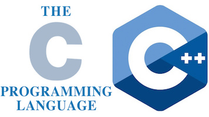

# C/C++ contribution layer for Spacemacs




<!-- markdown-toc start - Don't edit this section. Run M-x markdown-toc/generate-toc again -->
**Table of Contents**

- [C/C++ contribution layer for Spacemacs](#cc-contribution-layer-for-spacemacs)
    - [Description](#description)
    - [Features](#features)
    - [Install](#install)
        - [Layer](#layer)
        - [Default mode for header files](#default-mode-for-header-files)
        - [Enable Clang support](#enable-clang-support)
            - [clang-format](#clang-format)
            - [Company-clang and flycheck](#company-clang-and-flycheck)
    - [Key Bindings](#key-bindings)

<!-- markdown-toc end -->

## Description

This layer adds configuration for C/C++ language as well support for [CMake][]
scripts.

## Features

- Support syntax checking via flycheck with Clang.
- Support code reformatting with [clang-format][].
- Display function or variable definition at the bottom. (when `semantic` layer is included)
- Display current function cursor is in at the top. See [this page][stickyfunc-demos]
for demos in some programming languages. (when `semantic` layer is included)
- Support common refactoring with [semantic-refactor][]. See [this page][srefactor-demos]
for demonstration of refactoring features. (when `semantic` layer is included)

## Install

### Layer

To use this contribution add it to your `~/.spacemacs`

```elisp
(setq-default dotspacemacs-configuration-layers '(c-c++))
```

** Note: ** [semantic-refactor][] is only available for Emacs 24.4+

### Default mode for header files

By default header files are open in `c-mode`, you can open them in `c++-mode`
by setting the variable `c-c++-default-mode-for-headers` to `c++-mode`.

```elisp
(setq-default dotspacemacs-configuration-layers
  '((c-c++ variables:
           c-c++-default-mode-for-headers 'c++-mode)))
```

**Note** To set the variable for a given project, create a directory local
variable at the root of your project. More info on directory local variables
can be found in the [emacs documentation][dir-locals].

### Enable Clang support

To enable Clang support set the layer variable `c-c++-enable-clang-support`
to `t` in the dotfile:

```elisp
(setq-default dotspacemacs-configuration-layers
  '((c-c++ :variables c-c++-enable-clang-support t)))
```

#### clang-format

[clang-format][] allows reformatting either a selected region of code
(`clang-format-region`) or a whole buffer (`clang-format-buffer`) to make it
conform to a style defined in a `.clang-format` file. This file is either
located in the same directory as the file being edited, or in any of its parent
directories (otherwise a default style will be used).

You can add snippets similar to the following to bind clang-format to either a
particular mode or all modes in your `dotspacemacs/config` (within your
`~/.spacemacs`):

```elisp
;; Bind clang-format-region to C-M-tab in all modes:
(global-set-key [C-M-tab] 'clang-format-region)
;; Bind clang-format-buffer to tab on the c++-mode only:
(add-hook 'c++-mode-hook 'clang-format-bindings)
  (defun clang-format-bindings ()
    (define-key c++-mode-map [tab] 'clang-format-buffer))
```

#### Company-clang and flycheck

This layer adds some fancy improvements to `company-clang`.
It includes a hook to load a projects `.clang_complete` file, which is
just a text file with one clang flag per line, a format also used by
other text editor clang plugins.

Not only does this allow proper autocomplete on projects with extra
includes and flags, but there is also support for flycheck so that it
doesn't complain about missing header files.

## Key Bindings

    Key Binding       |                 Description
----------------------|------------------------------------------------------------
<kbd>SPC m g o</kbd>  | open matching file (e.g. switch between .cpp and .h)
<kbd>SPC m g O</kbd>  | open matching file in another window (e.g. switch between .cpp and .h)
<kbd>SPC m r</kbd>    | srefactor: refactor thing at point.

** Note: ** [semantic-refactor][] is only available for Emacs 24.4+

[CMake]: http://www.cmake.org/
[semantic-refactor]: https://github.com/tuhdo/semantic-refactor
[srefactor-demos]: https://github.com/tuhdo/semantic-refactor/blob/master/srefactor-demos/demos.org
[stickyfunc-demos]: https://github.com/tuhdo/semantic-stickyfunc-enhance
[clang-format]: http://clang.llvm.org/docs/ClangFormat.html
[dir-locals]: http://www.gnu.org/software/emacs/manual/html_node/elisp/Directory-Local-Variables.html
