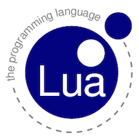

# Lua contribution layer for Spacemacs



<!-- markdown-toc start - Don't edit this section. Run M-x markdown-toc/generate-toc again -->
**Table of Contents**

- [Lua contribution layer for Spacemacs](#lua-contribution-layer-for-spacemacs)
    - [Description](#description)
    - [Install](#install)
    - [Key Bindings](#key-bindings)

<!-- markdown-toc end -->

## Description

This layer adds support for editing Lua.

Features:
- Editing lua files using [lua-mode][]
- Sending code to a lua REPL

## Install

To use this contribution add it to your `~/.spacemacs`

```elisp
(setq-default dotspacemacs-configuration-layers '(lua))
```

## Key Bindings

### commands

    Key Binding      |                 Description
---------------------|------------------------------------------------------------
<kbd>SPC m d</kbd>   | lookup thing at point in lua documentation
<kbd>SPC m s b</kbd> | send buffer contents to REPL
<kbd>SPC m s f</kbd> | send current function to REPL
<kbd>SPC m s l</kbd> | send current line to REPL
<kbd>SPC m s r</kbd> | send current region to REPL

[lua-mode]: https://github.com/immerrr/lua-mode 
