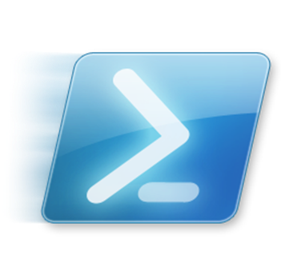

# Windows Scripting contribution layer for Spacemacs



<!-- markdown-toc start - Don't edit this section. Run M-x markdown-toc/generate-toc again -->
**Table of Contents**

- [Windows Scripting contribution layer for Spacemacs](#windows-scripting-contribution-layer-for-spacemacs)
    - [Description](#description)
    - [Install](#install)
    - [Key Bindings](#key-bindings)
        - [Powershell](#powershell)
        - [Batch (dos.el)](#batch-dosel)

<!-- markdown-toc end -->

## Description

This simple layer adds support for the Powershell scripting language as well
as support for batch files.

Incuded packages for extensions:
- `.ps1`: [powershell][]
- `.bat`: [dos.el][]

## Install

To use this contribution add it to your `~/.spacemacs`

```elisp
(setq-default dotspacemacs-configuration-layers '(windows-scripts))
```

## Key Bindings

### Powershell

No useful bindings.

### Batch (dos.el)

    Key Binding       |                 Description
----------------------|------------------------------------------------------------
<kbd>SPC m D</kbd>    | ask for a command and display help
<kbd>SPC m e b</kbd>  | evaluate buffer
<kbd>SPC m e B</kbd>  | evaluate buffer with args
<kbd>SPC m s</kbd>    | insert separator ` & `
<kbd>SPC m t</kbd>    | mini snippet to start a batch script
<kbd>SPC m T</kbd>    | big snippet to start a batch script
<kbd>SPC m z</kbd>    | toggle outline

[powershell]: https://github.com/jschaf/powershell.el
[dos.el]: http://www.emacswiki.org/emacs/dos.el
