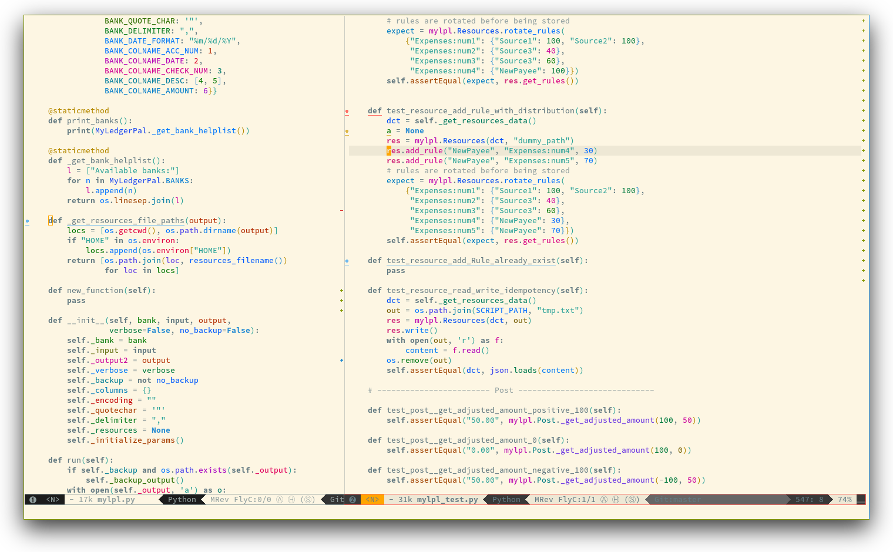
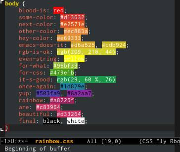

# Colors contribution layer for Spacemacs


<!-- markdown-toc start - Don't edit this section. Run M-x markdown-toc/generate-toc again -->
**Table of Contents**

- [Colors contribution layer for Spacemacs](#colors-contribution-layer-for-spacemacs)
    - [Description](#description)
    - [Install](#install)
        - [Enable rainbow-identifiers](#enable-rainbow-identifiers)
        - [Enable Nyan cat](#enable-nyan-cat)
    - [Key bindings](#key-bindings)
        - [Rainbow Identifiers](#rainbow-identifiers)
        - [Rainbow Mode](#rainbow-mode)

<!-- markdown-toc end -->

## Description

This layer colors your life with:
- [rainbow identifiers][]
- [rainbow mode][]
- [nyan mode][]

[rainbow identifiers][] mode will colorize each variables and functions with an
almost unique color. The keywords and the declaration of function colors are
disabled in order to make the colorized variables and functions stand out.

[rainbow mode][] displays strings representing colors with the color they
represent as background.

[nyan mode][] display a Nyan cat progress bar in the mode-line.

## Install

To use this contribution add it to your `~/.spacemacs`

```elisp
(setq-default dotspacemacs-configuration-layers '(colors))
```

### Enable rainbow-identifiers

To enable the package `rainbow-identifiers` set the variable
`colors-enable-rainbow-identifiers` to `t`:

```elisp
(setq-default dotspacemacs-configuration-layers '(
  (colors :variables colors-enable-rainbow-identifiers t)))
```

Saturation and lightness of identifiers can be set per theme by adding
an entry in the variable `colors-theme-identifiers-sat&light`. This
is an alist where the key is a theme symbol and the value is a pair
`(saturation lightness)`.

Example:

```elisp
(push '(mytheme . (50 50)) colors-theme-identifiers-sat&light)
```

### Enable Nyan cat

To enable the package `nyan-mode` set the variable
`colors-enable-nyan-cat-progress-bar` to `t`:

```elisp
(setq-default dotspacemacs-configuration-layers '(
  (colors :variables colors-enable-nyan-cat-progress-bar t)))
```

It may be handy to enable it only in a GUI, you can do it by using
a quasi-quoted list:

```elisp
(setq-default dotspacemacs-configuration-layers
  `((colors :variables
            colors-enable-nyan-cat-progress-bar ,(display-graphic-p))))
```

## Key bindings

The prefix associated with colors is <kbd>C</kbd>.

### Rainbow Identifiers



`rainbow-identifiers` mode can be toggled on and off with:

    <SPC> t C i

Note that the toggle is local to the current buffer.

The `saturation` and `lightness` of identifier colors can be adjusted live
with the micro-state:

Key Binding   | Description
--------------|------------------------------------------------------------
`<SPC> C i s` | initiate change `saturation` mini-mode
`<SPC> C i l` | initiate change `lightness` mini-mode
`+`           | increase the `saturation` or `lightness`
`-`           | decrease the `saturation` or `lightness`
`=`           | reset the `saturation` or `lightness`
Any other key | leave the change mini-mode

### Rainbow Mode



`rainbow-mode` mode can be toggled on and off with:

    <SPC> t C c

### Nyan Mode

`nyan-mode` mode can be toggled on and off with:

    <SPC> t m n

Note that the toggle is local to the current buffer.

[rainbow identifiers]: https://github.com/Fanael/rainbow-identifiers
[rainbow mode]: https://julien.danjou.info/projects/emacs-packages
[nyan mode]: https://github.com/syl20bnr/nyan-mode

