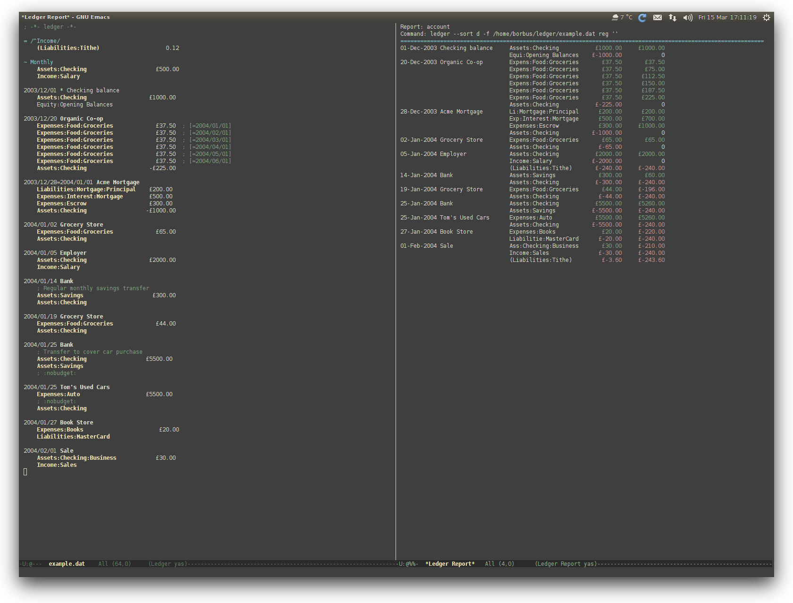

# Finance contribution layer for Spacemacs

<!-- markdown-toc start - Don't edit this section. Run M-x markdown-toc/generate-toc again -->
**Table of Contents**

- [Finance contribution layer for Spacemacs](#finance-contribution-layer-for-spacemacs)
    - [Description](#description)
    - [Install](#install)
    - [Key bindings](#key-bindings)
        - [Ledger](#ledger)

<!-- markdown-toc end -->

## Description

This layer adds finance related packages:
- [ledger][] support via [ledger-mode][]



## Install

To use this contribution add it to your `~/.spacemacs`

```elisp
(setq-default dotspacemacs-configuration-layers '(finance))
```

## Key bindings

### Ledger

    Key Binding      |                 Description
---------------------|----------------------------------------------------------
<kbd>SPC m a</kbd>   | add a transaction
<kbd>SPC m b</kbd>   | edit a post amount with Emacs Calculator mode
<kbd>SPC m c</kbd>   | toggle 'cleared' flag on transaction or post
<kbd>SPC m C</kbd>   | sort and align the entire buffer
<kbd>SPC m d</kbd>   | delete current transaction
<kbd>SPC m p</kbd>   | display balance at point
<kbd>SPC m q</kbd>   | align a single transaction's posts
<kbd>SPC m r</kbd>   | reconcile an account
<kbd>SPC m R</kbd>   | display a report
<kbd>SPC m t</kbd>   | append an effective date to a post
<kbd>SPC m y</kbd>   | set the year for quicker entry
<kbd>SPC m RET</kbd> | set the month for quicker entry


[ledger]: https://github.com/ledger/ledger
[ledger-mode]: https://github.com/ledger/ledger/tree/next/lisp

