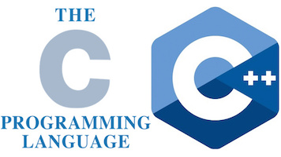

# C/C++ contribution layer for Spacemacs




<!-- markdown-toc start - Don't edit this section. Run M-x markdown-toc/generate-toc again -->
**Table of Contents**

- [C/C++ contribution layer for Spacemacs](#cc-contribution-layer-for-spacemacs)
    - [Description](#description)
    - [Install](#install)

<!-- markdown-toc end -->

## Description

This layer adds configuration for C/C++ language as well support for [CMake][]
scripts.

## Features

- Support syntax checking with Clang.
- Display function or variable definition at the bottom.
- Display current function cursor is in at the top. See [this page][stickyfunc-demos]
for demos in some programming languages.
- Support common refactoring with [semantic-refactor][]. See [this page][srefactor-demos]
for demonstration of refactoring features.

### Clang Fanciness

This layer adds some fancy improvements to `company-clang`.
It includes a hook to load a projects `.clang_complete` file, which is
just a text file with one clang flag per line, a format also used by
other text editor clang plugins.

Not only does this allow proper autocomplete on projects with extra
includes and flags, but there is also support for flycheck so that it
doesn't complain about missing header files.

## Key Bindings

    Key Binding       |                 Description
----------------------|------------------------------------------------------------
<kbd>SPC m g o</kbd>  | open matching file (e.g. switch between .cpp and .h)
<kbd>SPC m g O</kbd>  | open matching file in another window (e.g. switch between .cpp and .h)
<kbd>SPC m r</kbd>    | srefactor: refactor thing at point.


## Install

To use this contribution add it to your `~/.spacemacs`

```elisp
(setq-default dotspacemacs-configuration-layers '(c-c++))
```

** Note: ** [semantic-refactor][] is only available for Emacs 24.4+

[CMake]: http://www.cmake.org/
[semantic-refactor]: https://github.com/tuhdo/semantic-refactor
[srefactor-demos]: https://github.com/tuhdo/semantic-refactor/blob/master/srefactor-demos/demos.org
[stickyfunc-demos]: https://github.com/tuhdo/semantic-stickyfunc-enhance
