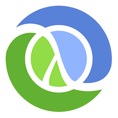

# Clojure contribution layer for Spacemacs



## Description

This layer adds support for [Clojure](http://clojure.org) language using [Cider](https://github.com/clojure-emacs/cider)

Cider requires nRepl middleware to function, please check the installation instructions at https://github.com/clojure-emacs/cider


## Packages Included

- [Cider](https://github.com/clojure-emacs/cider)
- [clojure-mode](https://github.com/clojure-emacs/clojure-mode)
- [Clj Refactor](https://github.com/clojure-emacs/clj-refactor.el)
- [Cider Auto Complete](https://github.com/clojure-emacs/ac-cider)


## Install

To use this contribution add it to your `~/.spacemacs`

```elisp
(setq-default dotspacemacs-configuration-layers '(clojure)
  "List of contribution to load."
)
```


## Key Bindings

### Folding (js2-mode)

    Key Binding       |                 Description
----------------------|------------------------------------------------------------
<kbd>SPC m j</kbd>    | cider jack in
<kbd>SPC m k</kbd>    | cider load-buffer
<kbd>SPC m z</kbd>    | switch to repl
<kbd>SPC m d d</kbd>  | cider-doc
<kbd>SPC m d g</kbd>  | cider-grimoire
<kbd>SPC m d j</kbd>  | cider javadoc
<kbd>SPC m e b</kbd>  | eval buffer
<kbd>SPC m e r</kbd>  | eval region
<kbd>SPC m e s</kbd>  | eval last sexp
<kbd>SPC m g v</kbd>  | goto var
<kbd>SPC m g e</kbd>  | goto error
<kbd>SPC m g s</kbd>  | goto symbol
<kbd>SPC m t t</kbd>  | run tests
