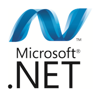

# C# contribution layer for Spacemacs

 

<!-- markdown-toc start - Don't edit this section. Run M-x markdown-toc/generate-toc again -->
**Table of Contents**

- [C# contribution layer for Spacemacs](#c-contribution-layer-for-spacemacs)
    - [Description](#description)
    - [Packages Included](#packages-included)
    - [Install](#install)
        - [Prerequisites](#prerequisites)
            - [ASP.NET 5](#aspnet-5)
            - [curl](#curl)
            - [Omnisharp server](#omnisharp-server)
    - [Caveats](#caveats)
    - [Key Bindings](#key-bindings)
        - [Compilation](#compilation)
        - [File/Solution/Project manipulation](#filesolutionproject-manipulation)
        - [Navigation](#navigation)
        - [Helpers (documentation, info)](#helpers-documentation-info)
        - [Refactoring](#refactoring)
        - [OmniSharp server interaction](#omnisharp-server-interaction)
        - [Tests](#tests)
        - [Code manipulation](#code-manipulation)

<!-- markdown-toc end -->

## Description

This layer adds experimental support for C# language using [OmniSharp][].

## Packages Included

- [OmniSharp-emacs][]
- [OmniSharp-server][]

## Install

To use this contribution add it to your `~/.spacemacs`

```elisp
(setq-default dotspacemacs-configuration-layers '(csharp))
```

### Prerequisites

#### ASP.NET 5

Follow the instructions for your platform [here][aspnet].

#### curl

You'll need [curl][] to be able to use the Omnisharp package. Use your favorite
package manager to install it (on Windows you can use [chocolatey][]).

Be sure to make the `curl` binary available to your PATH environment variable,
or set the variable `omnisharp--curl-executable-path` in your dotfile function
`dotspacemacs-config`:

```elisp
(setq-default omnisharp--curl-executable-path "/PATH/TO/CURL/curl")
```

#### Omnisharp server

You have to compile the OmniSharp server following the instructions which can
be found [here][server_install].

Don't forget to add the server binary directory to your system PATH environment
variable. The full path the binary can also be directly referenced in the
variable `omnisharp-server-executable-path` (put this in your
`dotspacemacs-config` function):

```elisp
(setq-default omnisharp-server-executable-path "/PATH/TO/OMNISHARP/OmniSharpServer")
```

OmniSharp should now automatically load and start a server when you open a
`.cs` file.

## Caveats

- It's currently not possible to create a C# solution outside of an IDE such as
[MonoDevelop][], it's therefore recommended that you install it to create your
solutions.

- Debugging is possible using [SDB][].

## Key Bindings


### Compilation

    Key Binding       |                 Description
----------------------|------------------------------------------------------------
<kbd>mcc</kbd>        | Build the solution

### File/Solution/Project manipulation

    Key Binding       |                 Description
----------------------|------------------------------------------------------------
<kbd>mfa</kbd>        | Add the current file to solution
<kbd>mfA</kbd>        | Add files selected in dired to solution
<kbd>mfr</kbd>        | Remove the current file from solution
<kbd>mfR</kbd>        | Removed files selected in dired from solution
<kbd>mpl</kbd>        | Add reference to solution

### Navigation

    Key Binding       |                 Description
----------------------|------------------------------------------------------------
<kbd>mgf</kbd>        | Go to solution file
<kbd>mgF</kbd>        | Go to solution file then member
<kbd>mgg</kbd>        | Go to definition
<kbd>mgG</kbd>        | Go to definition in other window
<kbd>mgi</kbd>        | Find implementations
<kbd>mgm</kbd>        | Go to solution member
<kbd>mgM</kbd>        | Go to solution member in other window
<kbd>mgr</kbd>        | Go to region
<kbd>mgs</kbd>        | Find symbols using Helm
<kbd>mgu</kbd>        | Find usages of symbol under cursor using Helm

### Helpers (documentation, info)

    Key Binding        |                 Description
-----------------------|------------------------------------------------------------
"mht"                  | Get type information for symbol under cursor
"mhT"                  | Get type information for symbol under cursor and put it into kill-ring

### Refactoring

    Key Binding       |                 Description
----------------------|------------------------------------------------------------
<kbd>mrm</kbd>        | Rename symbol under cursor
<kbd>mrr</kbd>        | Refactor symbol under cursor

### OmniSharp server interaction

    Key Binding       |                 Description
----------------------|------------------------------------------------------------
<kbd>msr</kbd>        | Reload the solution
<kbd>mss</kbd>        | Start the OmniSharp server
<kbd>msS</kbd>        | Stop the OmniSharp server

### Tests

    Key Binding       |                 Description
----------------------|------------------------------------------------------------
<kbd>mta</kbd>        | Run all tests in project
<kbd>mtb</kbd>        | Run all tests in current file/fixture
<kbd>mtt</kbd>        | Run test under cursor

### Code manipulation

    Key Binding       |                 Description
----------------------|------------------------------------------------------------
<kbd>mo</kbd>         | Auto complete overrides
<kbd>mi</kbd>         | Fix usings/imports
<kbd>m=</kbd>         | Format the current buffer

[server_install]: https://github.com/OmniSharp/omnisharp-server
[aspnet]: https://github.com/aspnet/home#getting-started
[OmniSharp]: https://github.com/OmniSharp/omnisharp-emacs
[OmniSharp-emacs]: https://github.com/OmniSharp/omnisharp-emacs
[OmniSharp-server]: https://github.com/OmniSharp/omnisharp-server
[MonoDevelop]: http://www.monodevelop.com/
[SDB]: https://github.com/mono/sdb
[curl]: http://curl.haxx.se/
[chocolatey]: https://chocolatey.org/
