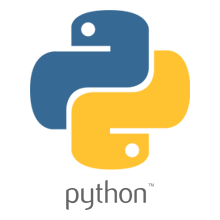

# Elpy contribution layer for Spacemacs




## Description

This layer adds support for the Python language through the use of [elpy][].

## Install

Install [jedi][] and [elpy][] with `pip install jedi elpy`.  
To use this contribution add it to your `~/.spacemacs`

```elisp
(setq-default dotspacemacs-configuration-layers '(elpy)
  "List of contribution to load."
)
```
<!-- markdown-toc start - Don't edit this section. Run M-x markdown-toc/generate-toc again -->
**Table of Contents**

- [Elpy contribution layer for Spacemacs](#elpy-contribution-layer-for-spacemacs)
    - [Description](#description)
    - [Install](#install)
    - [Key Bindings](#key-bindings)
        - [Inferior REPL process](#inferior-repl-process)
        - [Testing in Python](#testing-in-python)
        - [Other Python commands](#other-python-commands)

<!-- markdown-toc end -->

## Key Bindings

### Inferior REPL process

Start a Python or iPython inferior REPL process with <kbd>SPC m i</kbd>.
If `ipython` is available in system executable search paths, `ipython`
will be used to launch python shell; otherwise, default `python`
interpreter will be used.  You may change your system executable
search path by activating a virtual environment.

Send code to inferior process commands:

    Key Binding     |                 Description
--------------------|------------------------------------------------------------
<kbd>SPC m b</kbd>  | send buffer and keep code buffer focused
<kbd>SPC m B</kbd>  | send buffer and switch to REPL in insert mode
<kbd>SPC m f</kbd>  | send function and keep code buffer focused
<kbd>SPC m F</kbd>  | send function and switch to REPL in insert mode
<kbd>SPC m i</kbd>  | switch to REPL in insert mode
<kbd>SPC m r</kbd>  | send region and keep code buffer focused
<kbd>SPC m R</kbd>  | send region and switch to REPL in insert mode
<kbd>SPC m z</kbd>  | switch to REPL
<kbd>CTRL+j</kbd>   | next item in REPL history
<kbd>CTRL+k</kbd>   | previous item in REPL history

### Testing in Python

The root of the project is detected with a `.git` directory or a `setup.cfg` file.

To launch tests, use `<kbd>SPC m t</kbd>`

### Other Python commands

    Key Binding      |                 Description
---------------------|------------------------------------------------------------
<kbd>SPC m d</kbd>   | quick documentation
<kbd>SPC m g</kbd>   | go to definition using `elpy-goto-definition` (<kbd>C-o</kbd> to jump back)
<kbd>SPC m t b</kbd> | toggle a breakpoint
<kbd>SPC m v</kbd>   | activate a virtual environment

Documentation and goto key bindings will also work in `inferior-python-mode`

[elpy]: https://github.com/jorgenschaefer/elpy
[jedi]: https://github.com/tkf/emacs-jedi
