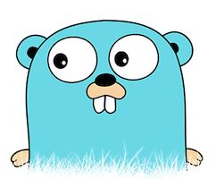

# go contribution layer for Spacemacs



<!-- markdown-toc start - Don't edit this section. Run M-x markdown-toc/generate-toc again -->
**Table of Contents**

- [go contribution layer for Spacemacs](#go-contribution-layer-for-spacemacs)
    - [Description](#description)
    - [Install](#install)
        - [Layer](#layer)
    - [Working with Go](#working-with-go)

<!-- markdown-toc end -->

## Description

This layers adds extensive support for go.

Features:
- gofmt on file save

## Install

### Layer

To use this contribution add it to your `~/.spacemacs`

```elisp
(setq-default dotspacemacs-configuration-layers '(go)
  "List of contribution to load."
)
```

## Working with Go

Go commands (start with `m`):

    Key Binding            |                 Description
---------------------------|------------------------------------------------------------
<kbd>SPC m d p</kbd>       | godoc at point
<kbd>SPC m i g</kbd>       | goto imports
<kbd>SPC m i a</kbd>       | add import
<kbd>SPC m i r</kbd>       | remove unused import
<kbd>SPC m p b</kbd>       | go-play buffer
<kbd>SPC m p r</kbd>       | go-play region
<kbd>SPC m p d</kbd>       | download go-play snippet
