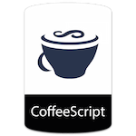

# JavaScript contribution layer for Spacemacs

 

<!-- markdown-toc start - Don't edit this section. Run M-x markdown-toc/generate-toc again -->
**Table of Contents**

- [JavaScript contribution layer for Spacemacs](#javascript-contribution-layer-for-spacemacs)
    - [Description](#description)
    - [Install](#install)
    - [Key Bindings](#key-bindings)
        - [js2-mode](#js2-mode)
        - [Folding (js2-mode)](#folding-js2-mode)
        - [Refactoring (js2-refactor)](#refactoring-js2-refactor)
            - [Documentation (js-doc)](#documentation-js-doc)
        - [Auto-complete and documentation (tern)](#auto-complete-and-documentation-tern)
        - [Formatting (web-beautify)](#formatting-web-beautify)

<!-- markdown-toc end -->

## Description

This layer adds support for the JavaScript language using [js2-mode][].

Main features:
- Smart code folding
- Refactoring: done using [js2-refactor][].
- Auto-completion and documentation: provided by [tern][]
- CoffeeScript support
- Formatting with [web-beautify][]

## Install

To use this contribution add it to your `~/.spacemacs`

```elisp
(setq-default dotspacemacs-configuration-layers '(javascript))
```

You will also need to install `tern` to use the auto-completion and
documentation features:

```shell
$ npm install -g tern
```
To use the formatting features, install `js-beautify`:

```shell
$ npm install -g tern
```

## Key Bindings

### js2-mode

    Key Binding     |                 Description
--------------------|------------------------------------------------------------
<kbd>SPC m w</kbd>  | toggle js2-mode warnings and errors

### Folding (js2-mode)

    Key Binding       |                 Description
----------------------|------------------------------------------------------------
<kbd>SPC m z c</kbd>  | hide element
<kbd>SPC m z o</kbd>  | show element
<kbd>SPC m z r</kbd>  | show all element
<kbd>SPC m z e</kbd>  | toggle hide/show element
<kbd>SPC m z F</kbd>  | toggle hide functions
<kbd>SPC m z C</kbd>  | toggle hide comments

### Refactoring (js2-refactor)

Bindings should match the plain emacs assignments.

    Key Binding         |                 Description
------------------------|------------------------------------------------------------
<kbd>SPC x m j</kbd>    | move line down, while keeping commas correctly placed
<kbd>SPC x m k</kbd>    | move line up, while keeping commas correctly placed
<kbd>SPC m k</kbd>      | deletes to the end of the line, but does not cross semantic boundaries
<kbd>SPC m r 3 i</kbd>  | converts ternary operator to if-statement
<kbd>SPC m r a g</kbd>  | creates a `/* global */` annotation if it is missing, and adds var to point to it
<kbd>SPC m r a o</kbd>  | replaces arguments to a function call with an object literal of named arguments
<kbd>SPC m r b a</kbd>  | moves the last child out of current function, if-statement, for-loop or while-loop
<kbd>SPC m r c a</kbd>  | converts a multiline array to one line
<kbd>SPC m r c o</kbd>  | converts a multiline object literal to one line
<kbd>SPC m r c u</kbd>  | converts a multiline function to one line (expecting semicolons as statement delimiters)
<kbd>SPC m r e a</kbd>  | converts a one line array to multiline
<kbd>SPC m r e f</kbd>  | extracts the marked expressions into a new named function
<kbd>SPC m r e m</kbd>  | extracts the marked expressions out into a new method in an object literal
<kbd>SPC m r e o</kbd>  | converts a one line object literal to multiline
<kbd>SPC m r e u</kbd>  | converts a one line function to multiline (expecting semicolons as statement delimiters)
<kbd>SPC m r e v</kbd>  | takes a marked expression and replaces it with a var
<kbd>SPC m r i g</kbd>  | creates a shortcut for a marked global by injecting it in the wrapping immediately invoked function expression
<kbd>SPC m r i p</kbd>  | changes the marked expression to a parameter in a local function
<kbd>SPC m r i v</kbd>  | replaces all instances of a variable with its initial value
<kbd>SPC m r l p</kbd>  | changes a parameter to a local var in a local function
<kbd>SPC m r l t</kbd>  | adds a console.log statement for what is at point (or region)
<kbd>SPC m r r v</kbd>  | renames the variable on point and all occurrences in its lexical scope
<kbd>SPC m r s l</kbd>  | moves the next statement into current function, if-statement, for-loop, while-loop
<kbd>SPC m r s s</kbd>  | splits a `String`
<kbd>SPC m r s v</kbd>  | splits a `var` with multiple vars declared into several `var` statements
<kbd>SPC m r t f</kbd>  | toggle between function declaration and function expression
<kbd>SPC m r u w</kbd>  | replaces the parent statement with the selected region
<kbd>SPC m r v t</kbd>  | changes local `var a` to be `this.a` instead
<kbd>SPC m r w i</kbd>  | wraps the entire buffer in an immediately invoked function expression
<kbd>SPC m r w l</kbd>  | wraps the region in a for-loop

### Formatting (web-beautify)

    Key Binding        |                 Description
-----------------------|------------------------------------------------------------
<kbd>SPC m =</kbd>     | beautify code in js2-mode, json-mode, web-mode, and css-mode

#### Documentation (js-doc)

    Key Binding        |                 Description
-----------------------|------------------------------------------------------------
<kbd>SPC m r d b</kbd> | insert JSDoc comment for current file
<kbd>SPC m r d f</kbd> | insert JSDoc comment for function
<kbd>SPC m r d t</kbd> | insert tag to comment
<kbd>SPC m r d h</kbd> | show list of available jsdoc tags

### Auto-complete and documentation (tern)

    Key Binding        |                 Description
-----------------------|------------------------------------------------------------
<kbd>SPC m C-g</kbd>   | brings you back to last place you were when you pressed M-..
<kbd>SPC m g g</kbd>   | jump to the definition of the thing under the cursor
<kbd>SPC m g G</kbd>   | jump to definition for the given name
<kbd>SPC m h d</kbd>   | find docs of the thing under the cursor. Press again to open the associated URL (if any)
<kbd>SPC m h t</kbd>   | find the type of the thing under the cursor
<kbd>SPC m r r V</kbd> | rename variable under the cursor using tern

[js2-mode]: https://github.com/mooz/js2-mode
[js2-refactor]: https://github.com/magnars/js2-refactor.el
[tern]: http://ternjs.net/
[js-doc]: https://github.com/mooz/js-doc/
[web-beautify]: https://github.com/yasuyk/web-beautify
