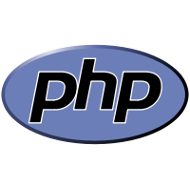

#PHP contribution layer for Spacemacs
 


<!-- markdown-toc start - Don't edit this section. Run M-x markdown-toc/generate-toc again -->
**Table of Contents**

- [PHP contribution layer for Spacemacs](#php-contribution-layer-for-spacemacs)
    - [Description](#description)
    - [Install](#install)
    - [Key bindings](#key-bindings)

<!-- markdown-toc end -->

## Description
This layer adds PHP language support to Spacemacs.

Features:
- Edit PHP files using [php-mode][]
- Edit Drupal files
- Run tests with PHPUnit
- Reformat code with PHP CBF

The `gtags` layer is recommended to benefit from better `eldoc` and
`helm-gtags`.

## Install

To use this contribution add it to your `~/.spacemacs`

```elisp
(setq-default dotspacemacs-configuration-layers '(php))
```

## Key bindings

TODO ! :-)

[php-mode]: https://github.com/ejmr/php-mode 
