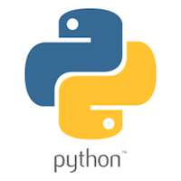

# Python contribution layer for Spacemacs



<!-- markdown-toc start - Don't edit this section. Run M-x markdown-toc/generate-toc again -->
**Table of Contents**

- [Python contribution layer for Spacemacs](#python-contribution-layer-for-spacemacs)
    - [Description](#description)
    - [Install](#install)
    - [Key Bindings](#key-bindings)
        - [Inferior REPL process](#inferior-repl-process)
        - [Testing in Python](#testing-in-python)
        - [Other Python commands](#other-python-commands)
        - [Django](#django)
            - [Fabric](#fabric)
            - [Files](#files)
            - [Interactive](#interactive)
            - [Server](#server)
            - [South/Syncdb](#southsyncdb)
            - [Test](#test)

<!-- markdown-toc end -->

## Description

This layer adds support for the Python language.

Features:
- Auto-completion using [anaconda-mode][]
- Code Navigation using  [anaconda-mode][]
- Documentation Lookup using  [anaconda-mode][] and [pylookup][]
- Test Runner using [nose.el][]
- Virtual Environment using [pyvenv][]
- semantic mode is enabled
- Django support via [pony-mode][]

## Install

To use this contribution add it to your `~/.spacemacs`

```elisp
(setq-default dotspacemacs-configuration-layers '(python)
  "List of contribution to load."
)
```

## Key Bindings

### Inferior REPL process

Start a Python or iPython inferior REPL process with <kbd>SPC m i</kbd>.
If `ipython` is available in system executable search paths, `ipython`
will be used to launch python shell; otherwise, default `python`
interpreter will be used.  You may change your system executable
search path by activating a virtual environment.

Send code to inferior process commands:

    Key Binding     |                 Description
--------------------|------------------------------------------------------------
<kbd>SPC m b</kbd>  | send buffer and keep code buffer focused
<kbd>SPC m B</kbd>  | send buffer and switch to REPL in insert mode
<kbd>SPC m f</kbd>  | send function and keep code buffer focused
<kbd>SPC m F</kbd>  | send function and switch to REPL in insert mode
<kbd>SPC m r</kbd>  | send region and keep code buffer focused
<kbd>SPC m R</kbd>  | send region and switch to REPL in insert mode
<kbd>CTRL+j</kbd>   | next item in REPL history
<kbd>CTRL+k</kbd>   | previous item in REPL history

### Testing in Python

`Spacemacs` uses [nose][nose] as a test runner. An improved version of
[nose.el][nose.el] is shipped with `Spacemacs`, this version adds:
- windows support
- test suite support

The root of the project is detected with a `.git` directory or a `setup.cfg` file.

Test commands (start with <kbd>m t</kbd> or <kbd>m T</kbd>):

    No Debug         |                 Description
---------------------|------------------------------------------------------------
<kbd>SPC m t a</kbd> | launch all tests of the project
<kbd>SPC m t b</kbd> | launch all tests of the current buffer (same as module)
<kbd>SPC m t m</kbd> | launch all tests of the current module
<kbd>SPC m t s</kbd> | launch all tests of the current suite
<kbd>SPC m t t</kbd> | launch the current test (function)

     Debug           |                 Description
---------------------|------------------------------------------------------------
<kbd>SPC m T a</kbd> | launch all tests of the project in debug mode
<kbd>SPC m T b</kbd> | launch all tests of the current buffer (module) in debug mode
<kbd>SPC m T m</kbd> | launch all tests of the current module in debug mode
<kbd>SPC m T s</kbd> | launch all tests of the current suite in debug mode
<kbd>SPC m T t</kbd> | launch the current test (function) in debug mode

### Other Python commands

    Key Binding       |                 Description
----------------------|------------------------------------------------------------
<kbd>SPC m d b</kbd>  | toggle a breakpoint
<kbd>SPC m h d</kbd>  | quick documentation using anaconda
<kbd>SPC m h D</kbd>  | open documentation in `firefox` using [pylookup][pylookup]
<kbd>SPC m g</kbd>    | go to definition using `anaconda-mode-goto` (<kbd>C-o</kbd> to jump back)
<kbd>SPC m v</kbd>    | activate a virtual environment with [pyvenv][pyvenv]

### Django

Django related key bindings uses [pony-mode][] and are behind the prefix
<kbd>SPC m j</kbd>.

Manage Django with <kbd>SPC m j m</kbd>.

#### Fabric

    Key Binding       |                 Description
----------------------|------------------------------------------------------------
<kbd>mjaf</kbd>       | pony-fabric
<kbd>mjad</kbd>       | pony-fabric-deploy

#### Files

    Key Binding       |                 Description
----------------------|------------------------------------------------------------
<kbd>mjfs</kbd>       | pony-goto-settings
<kbd>mjfc</kbd>       | pony-setting
<kbd>mjft</kbd>       | pony-goto-template
<kbd>mjfr</kbd>       | pony-resolve

#### Interactive

    Key Binding       |                 Description
----------------------|------------------------------------------------------------
<kbd>mjid</kbd>       | pony-db-shell
<kbd>mjis</kbd>       | pony-shell

#### Server

    Key Binding       |                 Description
----------------------|------------------------------------------------------------
<kbd>mjrd</kbd>       | pony-stopserver
<kbd>mjro</kbd>       | pony-browser
<kbd>mjrr</kbd>       | pony-restart-server
<kbd>mjru</kbd>       | pony-runserver
<kbd>mjrt</kbd>       | pony-temp-server

#### South/Syncdb

    Key Binding       |                 Description
----------------------|------------------------------------------------------------
<kbd>mjsc</kbd>       | pony-south-convert
<kbd>mjsh</kbd>       | pony-south-schemamigration
<kbd>mjsi</kbd>       | pony-south-initial
<kbd>mjsm</kbd>       | pony-south-migrate
<kbd>mjss</kbd>       | pony-syncdb

#### Test

    Key Binding       |                 Description
----------------------|------------------------------------------------------------
<kbd>mjtd</kbd>       | go down the stack
<kbd>mjte</kbd>       | go to test error
<kbd>mjto</kbd>       | pony-test-open
<kbd>mjtt</kbd>       | pony-test
<kbd>mjtu</kbd>       | go up the stack


[anaconda-mode]: https://github.com/proofit404/anaconda-mode
[pyvenv]: https://github.com/jorgenschaefer/pyvenv
[pylookup]: https://github.com/tsgates/pylookup
[nose]: https://github.com/nose-devs/nose/
[nose.el]: https://github.com/syl20bnr/nose.el
[pony-mode]: https://github.com/davidmiller/pony-mode
