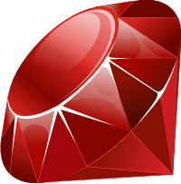

# Ruby contribution layer for Spacemacs



<!-- markdown-toc start - Don't edit this section. Run M-x markdown-toc/generate-toc again -->
**Table of Contents**

- [Ruby contribution layer for Spacemacs](#ruby-contribution-layer-for-spacemacs)
    - [Description](#description)
    - [Install](#install)
    - [Key bindings](#key-bindings)
        - [enh-ruby-mode](#enh-ruby-mode)
        - [ruby-test-mode](#ruby-test-mode)

<!-- markdown-toc end -->

## Description

This layer aims at providing support for the Ruby language using
[enh-ruby-mode][] and [robe-mode][].

## Install

To use this contribution add it to your `~/.spacemacs`

```elisp
(setq-default dotspacemacs-configuration-layers '(ruby)
  "List of contribution to load."
)
```

In order to take advantage of `robe-mode` you will probably need to
install the `pry` gem.
You can do that via your Gemfile:

```ruby
 gem 'pry'
```

or on the command line:

```shell
$ gem install pry
```

## Key bindings

### enh-ruby-mode

<kbd>SPC m i</kbd> start REPL
<kbd>SPC m g</kbd> go to definition (robe-jump)
<kbd>SPC m d</kbd> go to Documentation
<kbd>SPC m R</kbd> reload environment (Rails)

### ruby-test-mode

ruby-test-mode comes bundled with spacemacs, but this contribution adds
a couple of useful keybindings:

<kbd>SPC m t b</kbd> run test file
<kbd>SPC m t t</kbd> run test at pointer


[enh-ruby-mode]: https://github.com/zenspider/enhanced-ruby-mode
[robe-mode]: https://github.com/dgutov/robe
