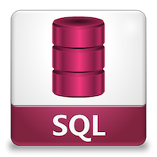

# SQL contribution layer for Spacemacs



<!-- markdown-toc start - Don't edit this section. Run M-x markdown-toc/generate-toc again -->
**Table of Contents**

- [SQL contribution layer for Spacemacs](#sql-contribution-layer-for-spacemacs)
    - [Description](#description)
    - [Install](#install)
    - [Key bindings](#key-bindings)
        - [Dialects and Clients](#dialects-and-clients)
        - [Inferior Process interactions (SQLi)](#inferior-process-interactions-sqli)
        - [SQLi buffer](#sqli-buffer)

<!-- markdown-toc end -->

## Description

This layer adds key bindings and configuration for `sql-mode`, which manages
interactive SQL buffers and highlights a wide range of SQL dialects.

## Install

To use this contribution layer add it to your `~/.spacemacs`

```elisp
(set-default dotspacemacs-configuration-layers '(sql))
```

## Key bindings

### Dialects and Clients

Database  | Client + Dialect     | Dialect (highlighting) only
----------|----------------------|----------------------------
ANSI SQL  | n/a                  | <kbd>SPC m h k a</kbd>
DB2       | <kbd>SPC m c d</kbd> | <kbd>SPC m h k d</kbd>
Informix  | <kbd>SPC m c i</kbd> | <kbd>SPC m h k i</kbd>
Ingrex    | <kbd>SPC m c n</kbd> | <kbd>SPC m h k n</kbd>
Interbase | <kbd>SPC m c t</kbd> | <kbd>SPC m h k t</kbd>
Linter    | <kbd>SPC m c l</kbd> | <kbd>SPC m h k l</kbd>
Microsoft | <kbd>SPC m c s</kbd> | <kbd>SPC m h k s</kbd>
MySQL     | <kbd>SPC m c m</kbd> | <kbd>SPC m h k m</kbd>
Oracle    | <kbd>SPC m c o</kbd> | <kbd>SPC m h k o</kbd>
Postgres  | <kbd>SPC m c p</kbd> | <kbd>SPC m h k p</kbd>
Solid     | <kbd>SPC m c S</kbd> | <kbd>SPC m h k S</kbd>
SQLite    | <kbd>SPC m c q</kbd> | <kbd>SPC m h k q</kbd>
Sybase    | <kbd>SPC m c b</kbd> | <kbd>SPC m h k b</kbd>
Vertica   | <kbd>SPC m c v</kbd> | <kbd>SPC m h k v</kbd>

### Inferior Process interactions (SQLi)

Key Binding          | Description
---------------------|--------------------------------------------------------------------
<kbd>SPC m b b</kbd> | show the SQLi buffer name
<kbd>SPC m b s</kbd> | set the SQLi buffer
<kbd>SPC m l a</kbd> | List all objects
<kbd>SPC m l t</kbd> | list all objects in a table

Send SQL queries to SQLi:

Key Binding          | Description
---------------------|--------------------------------------------------------------------
<kbd>SPC m s b</kbd> | Send the whole buffer to the SQLi buffer
<kbd>SPC m s B</kbd> | Send the whole buffer to the SQLi buffer and switch to it in `insert state`
<kbd>SPC m s f</kbd> | Send the paragraph under the point to the SQLi buffer
<kbd>SPC m s F</kbd> | Send the paragraph under the point to the SQLi buffer and switch to it in `insert state`
<kbd>SPC m s q</kbd> | Prompt for a string to send to the SQLi buffer
<kbd>SPC m s Q</kbd> | Prompt for a string to send to the SQLi buffer and switch to it in `insert state`
<kbd>SPC m s r</kbd> | Send the selected region to the SQLi buffer
<kbd>SPC m s R</kbd> | Send the selected region to the SQLi buffer and switch to it in `insert state`

### SQLi buffer

Key Binding          | Description
---------------------|----------------------------------------------------------------------
<kbd>SPC m b r</kbd> | rename buffer (follow up in the SQL buffer with <kbd>SPC m b s</kbd>)
<kbd>SPC m b S</kbd> | save the current connection
