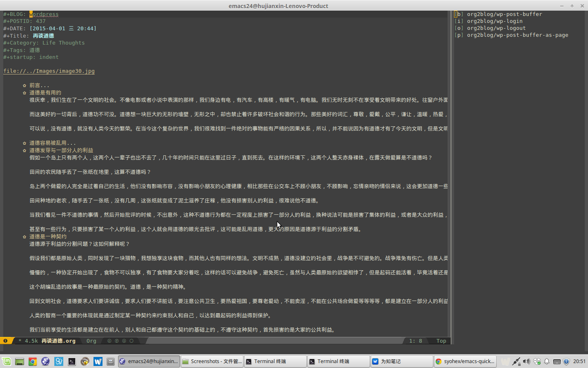

# Org2blog contribution layer for Spacemacs



<!-- markdown-toc start - Don't edit this section. Run M-x markdown-toc/generate-toc again -->
**Table of Contents**

- [Org2blog contribution layer for Spacemacs](#org-contribution-layer-for-spacemacs)
    - [Description](#description)
    - [Install](#install)
        - [Layer](#layer)
    - [Key bindings](#key-bindings)
        - [Org2blog with evil-org-mode](#org-with-evil-org-mode)

<!-- markdown-toc end -->

## Description
[org2blog/wp](https://github.com/punchagan/org2blog/blob/master/README.org) is a tool to publish directly from Emacs' org-mode to
[[http://wordpress.org/][WordPress]] blogs.  org2blog/wp is one of the two packages named
org2blog.  The other is [[http://repo.or.cz/r/org2blog.git/][org2blog/atom]] by [[http://tehom-blog.blogspot.com/][Tom Breton]].

org2blog/wp should, /ideally/, work with any platform that supports
xml-rpc but some of wordpress specific features may not work.

org2blog was inspired by and based on a [[http://paste.lisp.org/display/69993][wordpress posting client for
muse-mode]] written by [[http://www.emacswiki.org/emacs/AshishShukla][Ashish Shukla]].

org2blog is licensed under GPLv3

## Install

### Layer

To use this contribution add it to your `~/.spacemacs`

```elisp
(setq-default dotspacemacs-configuration-layers '(org2blog))
```

## Key bindings

### Org2blog with evil-org-mode

    Key Binding         |                 Description
------------------------|------------------------------------------------------------
<kbd>SPC a o b</kbd>    | org2blog/wp-post-buffer
<kbd>SPC a o i</kbd>    | org2blog/wp-login
<kbd>SPC a o o</kbd>    | org2blog/wp-logout
<kbd>SPC a o p</kbd>    | org2blog/wp-post-buffer-as-page


