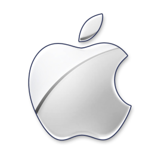

# OSX contribution layer for Spacemacs



<!-- markdown-toc start - Don't edit this section. Run M-x markdown-toc/generate-toc again -->
**Table of Contents**

- [OSX contribution layer for Spacemacs](#osx-contribution-layer-for-spacemacs)
    - [Description](#description)
    - [Philosophy](#philosophy)
    - [Install](#install)
        - [Layer](#layer)
        - [Coreutils](#coreutils)
    - [Key Bindings](#key-bindings)
    - [Future Work](#future-work)

<!-- markdown-toc end -->

## Description

Spacemacs is not just emacs+vim. It can have OSX keybindings too! 
This layer globally defines common OSX keybindings. ⌘ is set to
`super` and ⌥ is set to `meta`. Aside from that, there's nothing
much, really.

While in `dired` this layer will try to use `gls` instead of `ls`.

## Philosophy

While this layer enables common OSX bindings, it does not implement
OSX navigation keybindings. Spacemacs is meant to be used with evil,
and we encourage you to do so :)

## Install

### Layer

To use this configuration layer, add it to your `~/.spacemacs`

```elisp
(setq-default dotspacemacs-configuration-layers '(osx)
  ;; List of contribution to load.
)
```

### Coreutils

To get `gls` install coreutils homebrew:

```sh
brew install coreutils
```

## Key Bindings

    Key Binding   |       Description
------------------|------------------------------------------------------------
<kbd>⌘ q</kbd>    | Quit
<kbd>⌘ v</kbd>    | Paste
<kbd>⌘ c</kbd>    | Copy
<kbd>⌘ x</kbd>    | Cut
<kbd>⌘ w</kbd>    | Close window
<kbd>⌘ z</kbd>    | Undo
<kbd>⌘ Z</kbd>    | Redo
<kbd>⌃ ⌘ f</kbd>  | Toggle fullscreen

## Future Work

- Allow user to choose from either `hyper` or `super` as ⌘. This is an option that is supported cross-platform.
- Configurable option to keep the OSX and spacemacs clipboards separate
