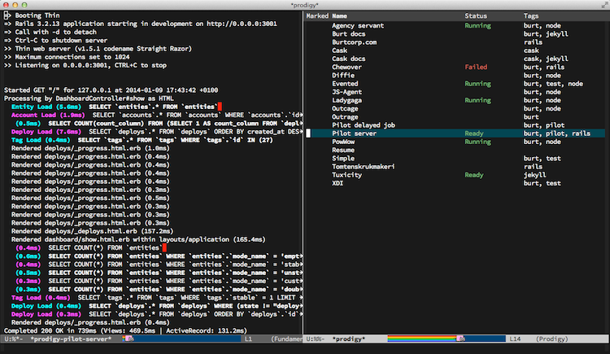

# Prodigy contribution layer for Spacemacs



<!-- markdown-toc start - Don't edit this section. Run M-x markdown-toc/generate-toc again -->
**Table of Contents**

- [Prodigy contribution layer for Spacemacs](#prodigy-contribution-layer-for-spacemacs)
    - [Description](#description)
    - [Install](#install)
    - [Key Bindings](#key-bindings)
        - [Spawn prodigy](#spawn-prodigy)
        - [Navigate through it](#navigate-through-it)

<!-- markdown-toc end -->

## Description

This layer adds support for the [prodigy][] package to manage external
services from within Emacs, check the package's documentation for more details

It is recommended to put  to put your prodigy services in the
`dotspacemacs/config` part of your .spacemacs file.

## Install

To use this contribution add it to your `~/.spacemacs`

```elisp
(setq-default dotspacemacs-configuration-layers '(prodigy))
```

## Key Bindings

### Spawn prodigy

You start prodigy with this:

    Key Binding       |                 Description
----------------------|------------------------------------------------------------
<kbd>SPC a S</kbd>    | Open the prodigy buffer

### Navigate through it

    Key Binding       |                 Description
----------------------|------------------------------------------------------------
<kbd>h</kbd>          | First service
<kbd>j</kbd>          | Next service
<kbd>k</kbd>          | Previous service
<kbd>l</kbd>          | Last service
<kbd>H</kbd>          | Display current process
<kbd>J</kbd>          | Next service with status
<kbd>K</kbd>          | Previous service with status
<kbd>L</kbd>          | Start prodigy
<kbd>S</kbd>          | Stop prodigy
<kbd>r</kbd>          | restart prodigy
<kbd>d</kbd>          | Jump to the dired of service
<kbd>g</kbd>          | Jump to magit-status of service
<kbd>Y</kbd>          | Copy prodigy command
<kbd>o</kbd>          | Browse the service
<kbd>f t</kbd>        | Add tag filter
<kbd>f n</kbd>        | Add name filter
<kbd>F</kbd>          | Clear filters

[prodigy]: https://github.com/rejeep/prodigy.el
