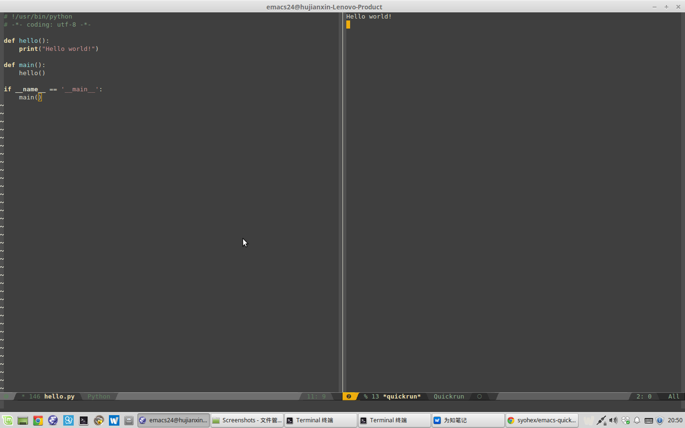

# Quickrun contribution layer for Spacemacs



- [Quickrun contribution layer for Spacemacs](#quickrun-contribution-layer-for-spacemacs)
    - [Install](#install)
    - [Key bindings](#key-bindings)

## Install

To use this contribution add it to your `~/.spacemacs`

```elisp
(setq-default dotspacemacs-configuration-layers '(quickrun))
```

## Key bindings

    Key Binding       |                 Description
----------------------|------------------------------------------------------------
<kbd>SPC a q</kbd>    | quick run 
