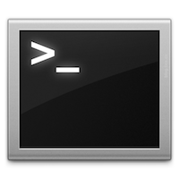

# Shell contribution layer for Spacemacs



<!-- markdown-toc start - Don't edit this section. Run M-x markdown-toc/generate-toc again -->
**Table of Contents**

- [Shell contribution layer for Spacemacs](#shell-contribution-layer-for-spacemacs)
    - [Description](#description)
    - [Install](#install)
        - [Layer](#layer)
        - [Default shell](#default-shell)
        - [Default shell position and height](#default-shell-position-and-height)
        - [Set shell for term and ansi-term](#set-shell-for-term-and-ansi-term)
    - [Key bindings](#key-bindings)
        - [Multi-term](#multi-term)

<!-- markdown-toc end -->

## Description

This layer configures the various shells available in Emacs.

## Install

### Layer

To use this contribution add it to your `~/.spacemacs`

```elisp
(setq-default dotspacemacs-configuration-layers '(shell))
```

### Default shell

Emacs supports three types of shell:
- the Emacs shell
- the inferior shell
- the terminal emulator
- the ANSI terminal emulator

You can find a quick introductions to them [here][mastering-emacs]

To define the default shell you can set the layer variable `shell-default-shell`
to the following variables:
- `eshell`
- `shell`
- `term`
- `ansi-term`
- `multi-term`

```elisp
(setq-default dotspacemacs-configuration-layers
  '(shell :variables shell-default-shell 'eshell))
```

The default shell is quickly accessible via a the default shortcut key
<kbd>SPC '</kbd>.

### Default shell position and height

It is possible to choose where the shell should pop by setting the variable
`shell-default-position` to either `top`, `bottom` or `full`. It is not
possible to show it on the side for now.
Default value is `bottom`.
It is also possible to set the default height in percents with the variable
`shell-default-height`. Default value is `30`.

```elisp
(setq-default dotspacemacs-configuration-layers
  '(shell :variables
          shell-default-position 'bottom
          shell-default-height 30))
```

### Set shell for term and ansi-term

The default shell can be set by setting the variable `shell-default-term-shell`.
Default value is `/bin/bash`.

```elisp
(setq-default dotspacemacs-configuration-layers
  '(shell :variables shell-default-term-shell "/bin/bash"))
```

## Key bindings

Key Binding          | Description
---------------------|------------------------------------------------------------
<kbd>SPC '</kbd>     | Open, close or go to the default shell
<kbd>SPC a s e</kbd> | Open, close or go to an `eshell`
<kbd>SPC a s i</kbd> | Open, close or go to a `shell`
<kbd>SPC a s m</kbd> | Open, close or go to a `multi-term`
<kbd>SPC a s t</kbd> | Open, close or go to a `ansi-term`
<kbd>SPC a s T</kbd> | Open, close or go to a `term`
<kbd>SPC m h</kbd>   | browse history with `helm` (works in `eshell` and `shell`)
<kbd>C-j</kbd>       | next item in history
<kbd>C-k</kbd>       | previous item in history

**Note** You can open multiple shells using a numerical prefix argument,
for instance pressing <kbd>2 SPC ;</kbd> will a second default shell, the
number of shell is indicated on the mode-line.

### Multi-term

Key Binding          | Description
---------------------|------------------------------------------------------------
<kbd>SPC p $ t</kbd> | run multi-term shell in root

[mastering-emacs]: https://www.masteringemacs.org/article/running-shells-in-emacs-overview
