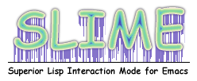

# SLIME contribution layer for Spacemacs



<!-- markdown-toc start - Don't edit this section. Run M-x markdown-toc/generate-toc again -->
**Table of Contents**

- [SLIME contribution layer for Spacemacs](#slime-contribution-layer-for-spacemacs)
    - [Description](#description)
    - [Install](#install)
    - [Key Bindings](#key-bindings)
    - [Future Work](#future-work)

<!-- markdown-toc end -->

## Description

A Spacemacs contribution layer for [SLIME][].

## Install

To use this contribution, add it to your `~/.spacemacs`

```elisp
(setq-default dotspacemacs-configuration-layers '(slime))
```

This layer defaults to using [sbcl][]. If you wan to use a different
implementation of Common Lisp, you can specify it in your `~/.spacemacs`:

```elisp
(defun dotspacemacs/config ()
  (setq inferior-lisp-program "/path/to/your/lisp"))
```

## Key Bindings

This layer doesn't yet include Spacemacsy keybindings.
The following is a list of some of SLIME's default keybindings.

    Key Binding   |       Description
------------------|------------------------------------------------------------
C-c               | Prefix Command
C-c C-k	          | Compile and load the current buffer's file.
C-c C-c	          | Compile the top-level form at point.
C-c C-d C-d	      | Describe symbol.
C-c C-d C-a	      | Apropos search.
M-n               | slime-repl-next-input
M-p               | slime-repl-previous-input
C-M-x             | lisp-eval-defun
C-h m             | check emacs mode help for all of SLIME's keybindings

## Future Work

- Add proper Spacemacs keybindings

[SLIME]: https://github.com/slime/slime
[sbcl]: http://www.sbcl.org/
