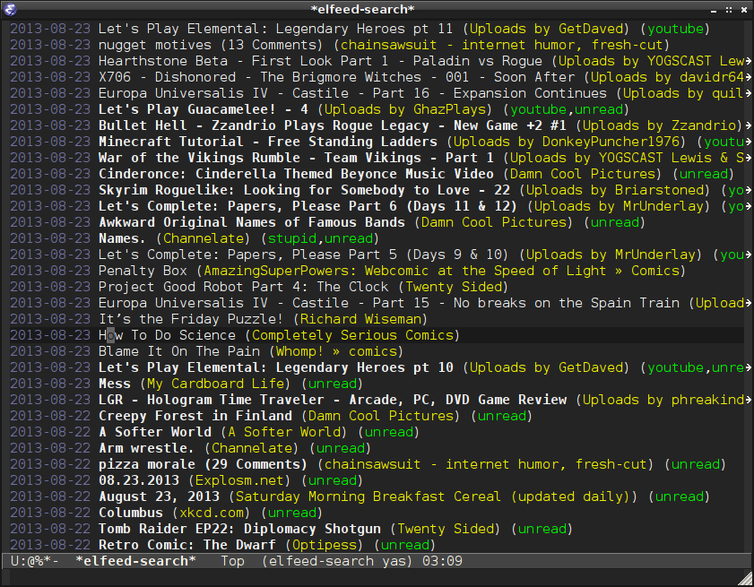

# Elfeed contribution layer for Spacemacs



<!-- markdown-toc start - Don't edit this section. Run M-x markdown-toc/generate-toc again -->
**Table of Contents**

- [Elfeed contribution layer for Spacemacs](#elfeed-contribution-layer-for-spacemacs)
    - [Description](#description)
    - [Install](#install)
        - [Layer](#layer)
    - [Usage](#usage)
        - [Importing Feeds](#importing-feeds)
        - [Key Bindings](#key-bindings)

<!-- markdown-toc end -->

## Description

This layer enables [Elfeed][], a web feeds client which supports both Atom and RSS feeds.
It'll optionally enable supporting packages, such as `elfeed-web` and `elfeed-org`.

## Install

### Layer

To use this layer, add it to your `~/.spacemacs`

```emacs-lisp
(setq-default dotspacemacs-configuration-layers '(elfeed))
```

By default, `elfeed` stores its database under `~/.elfeed`

## Usage

Add your feeds to the `elfeed-feeds` variable in `.spacemacs`, or specify location
of an org file containing a feed list (see example).

Increase `url-queue-timeout` if getting "Queue timeout exceeded" errors.

```emacs-lisp
     (elfeed :variables
             rmh-elfeed-org-files ("~/.emacs.d/private/elfeed.org")
             elfeed-web-enabled-on-emacs-startup t
             url-queue-timeout 30
             elfeed-search-filter "@2-week-ago +unread ")
```

### Importing Feeds

Feeds can be specified in configuration variable, or interactively imported from
OPML, running `SPC-: elfeed-load-opml`, or `afo`.

When imported interactively, feedlist will be saved in your customization file.

### Key Bindings

Key Binding        | Description
-------------------|-------------
<kbd>SPC a f</kbd> | start elfeed

Use `SPC ?` to discover major-mode key bindings.

[Elfeed]: https://github.com/skeeto/elfeed/

### Custom Key Bindings

Key Binding        | Description
-------------------|-------------
<kbd>q</kbd>       | quit main window, or item view buffer.
<kbd>c</kbd>       | compact feed db 
<kbd>o</kbd>       | looad OPML
<kbd>w</kbd>       | start web server
<kbd>W</kbd>       | stop web server

