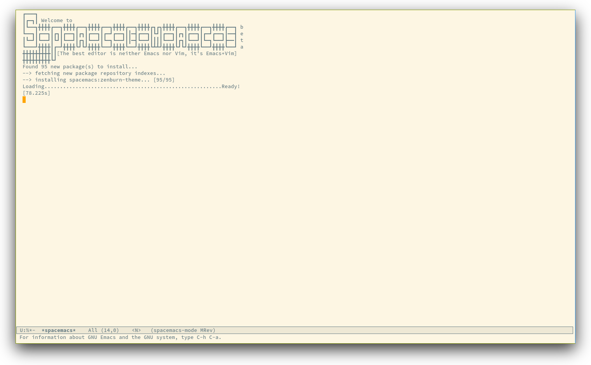

# Spacemacs Documentation

<!-- markdown-toc start - Don't edit this section. Run M-x markdown-toc/generate-toc again -->
**Table of Contents**

- [Spacemacs Documentation](#spacemacs-documentation)
- [Philosophy](#philosophy)
    - [Easy](#easy)
    - [Consistency](#consistency)
    - [Crowd-Configured](#crowd-configured)
- [Goals](#goals)
- [Screenshots](#screenshots)
- [Who can benefit from this ?](#who-can-benefit-from-this-)
- [Configuration layers](#configuration-layers)
    - [Structure](#structure)
    - [Extensions and Packages](#extensions-and-packages)
        - [Declaration](#declaration)
        - [Initialization](#initialization)
        - [Exclusion](#exclusion)
    - [Packages synchronization (Vundle like feature)](#packages-synchronization-vundle-like-feature)
    - [Types of configuration layers](#types-of-configuration-layers)
    - [Submitting a configuration layer upstream](#submitting-a-configuration-layer-upstream)
    - [Example: Themes Megapack example](#example-themes-megapack-example)
    - [Managing private configuration layers](#managing-private-configuration-layers)
        - [Using the private directory](#using-the-private-directory)
        - [Using an external Git repository](#using-an-external-git-repository)
        - [Using a personal branch](#using-a-personal-branch)
- [Dotfile Configuration](#dotfile-configuration)
    - [Installation](#installation)
    - [Content](#content)
        - [Using configuration layers](#using-configuration-layers)
        - [Excluding packages](#excluding-packages)
        - [Hooks](#hooks)
        - [Custom variables](#custom-variables)
- [Using the package list buffer](#using-the-package-list-buffer)
    - [Update all the packages](#update-all-the-packages)
- [Main principles](#main-principles)
    - [Evil](#evil)
        - [States](#states)
        - [Base States](#base-states)
    - [Evil leader](#evil-leader)
    - [Universal argument](#universal-argument)
- [Differences between Vim, Evil and Spacemacs](#differences-between-vim-evil-and-spacemacs)
    - [The vim-surround case](#the-vim-surround-case)
    - [Micro-states](#micro-states)
- [Color theme](#color-theme)
- [UI elements](#ui-elements)
    - [Toggles](#toggles)
    - [Mode-line](#mode-line)
        - [Flycheck integration](#flycheck-integration)
        - [Anzu integration](#anzu-integration)
        - [Battery status integration](#battery-status-integration)
        - [Powerline separators](#powerline-separators)
        - [Minor Modes](#minor-modes)
- [Base packages](#base-packages)
    - [Evil plugins](#evil-plugins)
- [Font](#font)
- [Commands](#commands)
    - [Reserved prefix command for user](#reserved-prefix-command-for-user)
    - [Escaping](#escaping)
    - [Executing Vim, Emacs and shell commands](#executing-vim-emacs-and-shell-commands)
    - [Navigating](#navigating)
        - [Point/Cursor](#pointcursor)
            - [Smooth scrolling](#smooth-scrolling)
            - [Experimental insert state feature](#experimental-insert-state-feature)
        - [Vim motions with ace-jump mode](#vim-motions-with-ace-jump-mode)
        - [Window manipulation](#window-manipulation)
            - [Resizing windows](#resizing-windows)
            - [Reposition window](#reposition-window)
            - [Golden ratio](#golden-ratio)
        - [Buffers and Files](#buffers-and-files)
        - [Ido](#ido)
            - [Experimental Ido feature](#experimental-ido-feature)
        - [NeoTree file tree](#neotree-file-tree)
        - [Shells](#shells)
            - [Key bindings](#key-bindings)
            - [Staying in insert state](#staying-in-insert-state)
        - [Bookmarks](#bookmarks)
    - [Searching](#searching)
        - [Project Searching](#project-searching)
        - [Persistent highlighting](#persistent-highlighting)
        - [Stacking highlights](#stacking-highlights)
        - [Highlight current symbol](#highlight-current-symbol)
        - [Visual Star](#visual-star)
        - [Listing symbols by semantic](#listing-symbols-by-semantic)
        - [Helm-swoop](#helm-swoop)
    - [Editing](#editing)
        - [Text manipulation commands](#text-manipulation-commands)
        - [Smartparens Strict mode](#smartparens-strict-mode)
        - [Zooming](#zooming)
            - [Text](#text)
            - [Frame](#frame)
        - [Increase/Decrease numbers](#increasedecrease-numbers)
        - [Spell checking](#spell-checking)
        - [Region selection](#region-selection)
        - [Region narrowing](#region-narrowing)
        - [Line formatting](#line-formatting)
        - [Auto-completion](#auto-completion)
        - [Commenting](#commenting)
        - [Deleting files](#deleting-files)
        - [Editing Lisp code](#editing-lisp-code)
            - [Key bindings maps](#key-bindings-maps)
                - [Regular normal state bindings](#regular-normal-state-bindings)
                - [Lisp specific bindings](#lisp-specific-bindings)
    - [Project management](#project-management)
    - [Registers](#registers)
    - [Errors handling](#errors-handling)
    - [Compiling](#compiling)
    - [Modes](#modes)
        - [Helm](#helm)
            - [Experimental Helm feature](#experimental-helm-feature)
        - [Ledger](#ledger)
        - [Org](#org)
        - [Python](#python)
        - [JavaScript](#javascript)
        - [rcirc](#rcirc)
- [Emacs Server](#emacs-server)
    - [Connecting to the Emacs server](#connecting-to-the-emacs-server)
    - [Keeping the server alive](#keeping-the-server-alive)
- [Tips](#tips)
    - [Updating Spacemacs](#updating-spacemacs)
    - [Tips for Emacs users](#tips-for-emacs-users)
    - [Troubleshoot](#troubleshoot)
        - [Loading fails](#loading-fails)
        - [I have no file ~/.spacemacs](#i-have-no-file-spacemacs)
    - [Tips for Spacemacs advanced users](#tips-for-spacemacs-advanced-users)
        - [evil-lisp-state as default state](#evil-lisp-state-as-default-state)
        - ["jk" to trigger evil leader](#jk-to-trigger-evil-leader)
        - [Smooth fonts on Windows](#smooth-fonts-on-windows)
- [Achievements](#achievements)
- [Thank you](#thank-you)

<!-- markdown-toc end -->

# Philosophy

Three core pillars: Easy, Consistency, "Crowd-Configured".

## Easy

`Spacemacs` organizes key bindings by mnemonic namespaces. If you are looking
for commands to operate on your buffer, they are right under <kbd>SPC b</kbd>,
if you want to operate on your project, then it is <kbd>SPC p</kbd>, etc...

`Spacemacs` comes with a dedicated major mode `spacemacs-mode`. Its goal is to
give useful feedbacks and perform maintenance tasks easily.

## Consistency

Similar functionalities should have the same key binding. For instance if you are
looking for the definition of a function, the binding is <kbd>SPC m g</kbd>,
`m` for `major mode` and `g` for `go to`. And no matter what is the major mode it
should be the same binding.

## Crowd-Configured

This term does not really exist but I'm sure you know what it means.

This is the most powerful feature of `Spacemacs`. Anybody can submit upstream
his or her configuration layer and anybody can use it in a second by adding it
in a dotfile and by optionally filtering it (ie. removing unwanted packages).

So by cloning this repository you have a centralized place of configured
packages tuned by expert in their domain. And most importantly it should be
consistent with the whole experience provided by `Spacemacs`.

If some packages are missing from core `Spacemacs` but they are present in
several contribution layers, chances are that they should be in core and we
can easily move them there.

If any of this core pillars are violated open an issue and we'll try to fix
this.

# Goals

- **Bring the power of modal editing** to the powerful Emacs editing platform.

- Integrate nicely with `Evil` states (`Vim` modes): `Spacemacs` tries to
**keep your fingers on the home row** as much as possible, no matter the mode
you are in.

- **Crowed-configured**: Contribute your own personal layer upstream and
everybody can use it.

- **Minimalistic and nice UI**, keep your available screen space for what
matters: your text files.

- **Mnemonic and consistent key bindings** which should be easier to learn
and remember.

- **Fast boot time**.

- **Lower the risk of RSI**.

- Hopefully, if it's not already the case:

Ɛ>Ɛ>Ɛ> **make you love modal editing!** <3<3<3

# Screenshots

_Startup_


_Python_


_Terminal (urxvt)_


*Note: Even though screenshots are updated frequently, `Spacemacs` is evolving
quickly and the screenshots may not reflect exactly the current state of the
project.*

# Who can benefit from this ?

`Spacemacs` is first intended to be used by **Vim users** who want to go to the
next level by using Emacs.

It is also a good fit for people wanting to **lower the [risk of RSI][RSI]**
induced by the default Emacs key bindings.

Emacs users wanting to learn **a different way to edit files** or wanting to
learn Vim key bindings (see [Tips for Emacs users](#tips-for-emacs-users)).

As a side note, if you are a programmer and you don't know Vim key bindings
yet, I deeply recommend you to learn the basics as recommended in
[Sacha Chua's one-page guide][sacha_guide] about how to learn Emacs.

# Configuration layers

_This part of Spacemacs is still in beta, the structure can change over
time. Refer to commit messages for more information in case of big changes._

## Structure

Configuration is organized in layers. Each layer has the following structure:

```
[layer_name]
  |__ [extensions]
  | |__ [mode 1]
  | |     ...
  | |__ [mode n]
  |__ config.el
  |__ extensions.el
  |__ funcs.el
  |__ keybindings.el
  |__ packages.el

[] = directory
```

Where:

      File        |                          Usage
------------------|-----------------------------------------------------------
config.el         | Emacs built-in configuration or mandatory configuration
extensions.el     | The list of extensions to load and the functions to initialize them
funcs.el          | Various functions and macros (often used in keybindings.el)
keybindings.el    | Emacs built-in key bindings or mandatory key bindings
packages.el       | The list of packages to install and the functions to initialize them

`Packages` are `ELPA` packages which can be installed from an `ELPA` compliant
repository, and `Extensions` are generally elisp code from git submodules.

## Extensions and Packages

### Declaration

`Extensions` and `Packages` are declared in variables `<layer>-pre-extensions`,
`<layer>-post-extensions` and `<layer>-packages` where `<layer>` is the layer
name. `Pre-Extensions` are loaded before `Packages` and `Post-Extensions` are
loaded after `Packages`.

They are processed in alphabetical order so sometimes you'll have to use
some `eval-after-load` black magic.

Example:

```elisp
(defvar <layer>-packages
  '(
    package1
    package2
    )
```

### Initialization

To initialize an extension or a package `xxx`, define a function with this
format in `extensions.el` or `packages.el`:

```elisp
(defun <layer>/init-xxx ()
   ...body
)
```

It is common to define the body with the [use-package][use-package] macro.

### Exclusion

It is possible to exclude some packages from `Spacemacs` in a per layer basis.
This is useful when a configuration layer aims to replace a stock package
declared in the `Spacemacs` layer.

To do so add the package names to exclude to the variable
`<layer>-excluded-packages`.

Example:

```elisp
(defvar <layer>-excluded-packages
  '(
    package1
    )
```

## Packages synchronization (Vundle like feature)

`Spacemacs` features a synchronization engine for the ELPA packages. It means
that `Spacemacs` will auto-install the new packages in `<layer>-packages` lists
_and_ auto-delete orphan packages in your `elpa` directory.

It effectively makes `Spacemacs` to behave like [Vundle][vundle].

## Types of configuration layers

There are three types of configuration layers:
- core (this is the `Spacemacs` layer)
- private (in the `private` directory, they are ignored by Git)
- contrib (in the `contrib` directory, those layers are contributions shared by
the community and merged upstream).

## Submitting a configuration layer upstream

If you decide to provide a `contrib` configuration layer, please check
the contribution guidelines in [CONTRIBUTE.md][].

## Example: Themes Megapack example

This is a simple `contrib` configuration layer listing a bunch of themes,
you can find it [here][themes-megapack].

To install it, just add `themes-megapack` to your `~/.spacemacs` like so:

```elisp
dotspacemacs-configuration-layers '(themes-megapack)
```

You have now installed around 100 themes you are free to try with <kbd>SPC T h</kbd>
(helm-themes).

## Managing private configuration layers

`Spacemacs` configuration system is flexible enough to let you manage your
private layers in different ways.

### Using the private directory

Everything in the private directory is ignored by Git so it is a good place
to store private layers. There is a huge drawback to this approach though:
_your layers are not source controlled_.

### Using an external Git repository

This is the recommended way to manage your private layers.

The best approach is to store all your private layers into an external Git
repository. It is especially a good practice to store them in your `dotfiles`
repository if you have one. Put also your `~/.spacemacs` file in it.

Then you are free to symlink your layers into `~/emacs.d/private` _or_ let
them anywhere you want and reference the parent directory in the variable
`dotspacemacs-configuration-layer-path` of your `~/.spacemacs`.

Note that you could also have a dedicated repository for all your private
layers and then directly clone this repository in `~/.emacs.d/private`.

### Using a personal branch

The final main way to manage your private layers is to push them in a personal
branch that you keep up to date with upstream `master` or `develop`.

# Dotfile Configuration

User configuration can be stored in your `~/.spacemacs` file.

## Installation

`~/.spacemacs` is an optional file. If you want to use it you have to copy it
manually from the template file `~/.emacs.d/core/templates/.spacemacs.template`

```sh
$ cp ~/.emacs.d/core/templates/.spacemacs.template ~/.spacemacs
```

## Content

### Using configuration layers

To use a configuration layer, add it to the `dotspacemacs-configuration-layers`
variable of your `~/.spacemacs`.

For instance to add the configuration layer of [RMS](#thank-you):
```elisp
(setq-default dotspacemacs-configuration-layers '(rms))
```
If this layer does not exist you can still try another one in
[the `contrib` directory](https://github.com/syl20bnr/spacemacs/tree/master/contrib).

Configuration layers are expected to be stored in `~/.emacs.d/private` or
`~/.emacs.d/contrib`. But you are free to keep them somewhere else by declaring
additional paths where `Spacemacs` can look for configuration layers.
This is done by setting the list
`dotspacemacs-configuration-layer-path` in your `~/.spacemacs`:

```elisp
(setq-default dotspacemacs-configuration-layer-path '("~/.myconfig/"))
```

### Excluding packages

You can exclude packages you don't want to install with the variable
`dotspacemacs-excluded-packages`, this variable can exclude both packages and
extensions (see [Configuration layers](#configuration-layers) for more info
on packages and extensions).

For instance to disable the `rainbow-delimiters` package:
```elisp
(setq-default dotspacemacs-excluded-packages '(rainbow-delimiters))
```

When you exclude a package, `Spacemacs` will automatically delete it for you
the next time you launch Emacs. All the orphan dependencies are as well
delete automatically.

### Hooks

Two special functions of the `~/.spacemacs` file can be used to perform
configuration at the beginning and end of `Spacemacs` loading process.

- `dotspacemacs/init` is triggered at the very beginning of `Spacemacs`
loading.
- `dotspacemacs/config` is triggered at the very end of `Spacemacs` loading.

### Custom variables

Custom variables configuration from `M-x customize-group` which are
automatically saved by Emacs are stored at the end of your `~/.spacemacs`
file.

# Using the package list buffer

The package list buffer is where you can selectively update one or all
packages installed in your configuration as well as browse for all
available packages in the different Elpa repositories.

`Spacemacs` replaces the default package list buffer with [Paradox][].
Paradox enhances the package list buffer with better feedbacks, new
filters and Github information like the number of stars. Optionally you
can also star packages directly in the buffer.

**Important Note** Don't install new packages from the package list
buffer. If those packages are not referenced in a configuration layer
then `Spacemacs` will treat them as orphans during the next start of
Emacs and they will be deleted.

    Key Binding      |                 Description
---------------------|------------------------------------------------------------
<kbd>/</kbd>         | evil-search
<kbd>f k</kbd>       | filter by keywords
<kbd>f r</kbd>       | filter by regexp
<kbd>f u</kbd>       | display only installed package with updates available
<kbd>h</kbd>         | go left
<kbd>H</kbd>         | show help (not accurate)
<kbd>j</kbd>         | go down
<kbd>k</kbd>         | go up
<kbd>l</kbd>         | go right
<kbd>L</kbd>         | show last commits
<kbd>n</kbd>         | next search occurrence
<kbd>N</kbd>         | previous search occurrence
<kbd>o</kbd>         | open package homepage
<kbd>r</kbd>         | refresh
<kbd>S P</kbd>       | sort by package name
<kbd>S S</kbd>       | sort by status (installed, available, etc...)
<kbd>S *</kbd>       | sort by Github stars
<kbd>v</kbd>         | `visual state`
<kbd>V</kbd>         | `visual-line state`
<kbd>x</kbd>         | execute (action flags)

## Update all the packages

To update all the buffers:
- open paradox: <kbd>SPC a P</kbd>
- filter packages (optional): <kbd>f u</kbd>
- update all: <kbd>U x y</kbd>

When asked for old packages deletion hit `y`.

# Main principles

## Evil

`Spacemacs` uses the [evil][evil] mode to emulate Vim key bindings. It is a
very complete emulation, maybe the most advanced. In fact, Evil is much more
than just a Vim emulation. It has more states than Vim for instance.

### States

`Spacemacs` has 6 states:

- **Normal** (orange) - like the `normal mode of Vim`, used to execute and
                        combine commands
- **Insert** (green) - like the `insert mode of Vim`, used to actually insert
                       text
- **Visual** (gray) - like the `visual mode of Vim`, used to make text
                      selection
- **Motion** (purple) - exclusive to `Evil`, used to navigate read only
                        buffers
- **Emacs** (blue) - exclusive to `Evil`, using this state is like using a
                     regular Emacs without Vim
- **Lisp** (pink) - exclusive to `Spacemacs`, used to navigate Lisp code and
                    modify it

### Base States

_(I apologize in advance for the number of repetition of the word `state` in
this section, but I encourage you to read again this section until you correctly
grasp the concept of `base state` since it is an important concept in
`Spacemacs`)_

`Spacemacs` has a notion of `base state`. A `base state` is the state you are
when leaving the `insert state`.

The typical `base state` in Vim is the `normal state` and it is the only one.
`Spacemacs` has more than one base state, here is the list:
- normal
- lisp

This allows a coder of Lisp to completely replace the `normal state` by the
`lisp state`. Indeed, once you fire up the `lisp state` you can just go back
and forth between the `insert state` and the `lisp state`.

Of course there is a rule to break this in order to be able to go back to the
`normal state`. It is pretty simple:

*When in a `base state`, `ESC` or the key chord `fd` will always set you back to the
`normal state`.*

So to go back to the `normal state` while in `lisp state` just hit `ESC` or hit both
`fd` together.

## Evil leader

`Spacemacs` heavily uses the [evil-leader][evil-leader] mode which brings the
Vim leader key to the Emacs world.

This leader key is commonly set to `,` by Vim users, in `Spacemacs` the leader
key is set on <kbd>SPC</kbd> (space bar, this is why the name `spacemacs`).
This key is the most accessible key on a keyboard and it is pressed with the
thumb which is a good choice to lower the risk of [RSI][RSI].

So with `Spacemacs` there is no need to remap your keyboard modifiers to
attempt to reduce the risk of RSI, every command can be executed very easily
while you are in `normal` mode by pressing the <kbd>SPC</kbd> leader key,
here are a few examples:

- Save a buffer: <kbd>SPC f s</kbd>
- Save all opened buffers: <kbd>SPC f S</kbd>
- Open (switch) to a buffer with `helm`: <kbd>SPC b s</kbd>

## Universal argument

The universal argument `C-u` is an important command in Emacs but it is also
a very handy Vim key binding to scroll up.

`Spacemacs` binds <kbd>C-u</kbd> to `scroll-up` and change the universal
argument binding to <kbd>SPC u</kbd>.

# Differences between Vim, Evil and Spacemacs

No doubt that `Evil` is one of the most advanced `Vim` emulation and you should
not see big difference between `Vim` and `Emacs`. I did not find any command I
used in Vim that I missed in Emacs with `Evil`

Send a PR to add the differences you found in this section.

## The vim-surround case

There is one more visible difference though. It is not between `Evil` and `Vim`
but between `Spacemacs` and [vim-surround][]: the `surround` command is on
<kbd>S</kbd> in `vim-surround` whereas it is on <kbd>s</kbd> in `Spacemacs`.

This is something that can surprise some Vim users so let me explain why this is
the case:
- `s` and `c` do the same thing in `visual state`,
- `s` is only useful to delete _one_ character and add more than one character
which is a _very_ narrow use case,
- `c` accept motions and can do everything `s` can do in `normal state`,
- this is also true for `r` but `r` is more useful because it stays in
`normal state`.
- `surround` command is just a more powerful command that `s`

If you are not convinced, then here is the snippet to revert back to the default
`Vim + vim-surround` setup (add it to your `dotspacemacs/config` function or
your `~/.spacemacs`):

```elisp
(evil-define-key 'visual evil-surround-mode-map "s" 'evil-substitute)
(evil-define-key 'visual evil-surround-mode-map "S" 'evil-surround-region)
```

## Micro-states

`Spacemacs` defines a wide variety of `micro-states` (temporary overlay maps)
where it makes sense. This prevent from repetitive and tedious presses on the
<kbd>SPC</kbd> key.

When a `micro-state` is active, a documentation is displayed in the minibuffer.
Additional information may as well be displayed in the minibuffer.

[Auto-highlight-symbol micro-state](#auto-highlight-and-edition-of-symbols):


[Text scale micro-state](#change-font-size):


# Color theme

By default, `Spacemacs` uses the theme [solarized-light][solarized-theme].

It is possible to define your default theme in your `~/.spacemacs` with
the variable `dotspacemacs-default-theme`. For instance, to specify `zenburn`:

```elisp
(setq-default
 ;; Default theme applied at startup
 dotspacemacs-default-theme 'zenburn)
```

Some themes are supported by `Spacemacs`:
- [Solarized][solarized-theme]
- [Leuven][leuven-theme]
- [Monokai][monokai-theme]
- [Zenburn][zenburn-theme]

It is possible to set any other themes but their compatibility with `Spacemacs`
is not guaranteed (i.e. there may be some missing faces etc...).

    Key Binding      |                 Description
---------------------|------------------------------------------------------------
<kbd>SPC T n</kbd>   | switch to next theme supported by `Spacemacs`.
<kbd>SPC h t</kbd>   | select a theme using a `helm` buffer.

**Note:** Due to the inner working of themes in Emacs, switching theme during
the same session may have some weird side effects. Although these side effects
should be pretty rare (especially when switching to a supported theme).

**Hint** If you are an `Org` user, [leuven-theme][] is amazing.

# UI elements

`Spacemacs` has a minimalistic and distraction free UI with a lot of subtle
customization which make it unique compared to other kits:
 - beautiful custom [powerline][powerline] mode-line
 [with color feedback](#flycheck-integration) according to current
 [Flycheck][flycheck]
 status
 - unicode symbols for minor mode lighters which appear in the mode-line
 - [custom fringe bitmaps](#errors-handling) and error feedbacks for
 [Flycheck][flycheck]
 - [custom fringe bitmaps](../contrib/git/README.md#git-gutter-bitmaps) for [git gutter][]
 - dedicated startup page with a mode aimed at easily managing `Spacemacs`

## Toggles

Some UI indicators can be toggled on and off (toggles start with `t`):

    Key Binding       |                 Description
----------------------|------------------------------------------------------------
<kbd>SPC t 8</kbd>    | display a mark on the 80th column
<kbd>SPC t F</kbd>    | toggle frame fullscreen
<kbd>SPC t f</kbd>    | toggle display of the fringe
<kbd>SPC t l</kbd>    | toggle truncate lines
<kbd>SPC t L</kbd>    | toggle visual lines
<kbd>SPC t M</kbd>    | toggle frame maximize
<kbd>SPC t n</kbd>    | show the absolute line numbers

## Mode-line

The mode line is an heavily customized [powerline][powerline] with the
following capabilities:
- show the window number
- color code for current state
- show the number of search occurrences via anzu
- toggle flycheck info
- toggle battery info
- toggle minor mode lighters

Reminder of the color codes for the states:

   Evil State     |       Color
------------------|------------------
Normal            | Orange
Insert            | Green
Visual            | Grey
Emacs             | Blue
Motion            | Purple
Lisp              | Pink

Some elements can be dynamically toggled:

    Key Binding        |                 Description
-----------------------|------------------------------------------------------------
<kbd>SPC t m m</kbd>   | toggle the minor mode lighters
<kbd>SPC t m b</kbd>   | toggle the battery status
<kbd>SPC t m f</kbd>   | toggle the flycheck info

### Flycheck integration

When [Flycheck][flycheck] minor mode is enabled, a new element appears showing
the number of errors, warnings and info.


### Anzu integration

[Anzu][anzu] shows the number of occurrence when performing a search. `Spacemacs`
integrates nicely the Anzu status by displaying it temporarily when `n` or `N` are
being pressed. See the `5/6` segment on the screenshot below.


### Battery status integration

[fancy-battery][] displays the percentage of total charge of the battery as
well as the time remaining to charge or discharge completely the battery.

A color code is used for the battery status:

 Battery State    |       Color
------------------|------------------
Charging          | Green
Discharging       | Orange
Critical          | Red

Note the these colors may vary depending on your theme.

### Powerline separators

It is possible to easily customize the `powerline separator` by setting the
`powerline-default-separator` variable in your `~./spacemacs`. For instance
if you want to set back the separator to the well-known `arrow` separator
add the following snippet to your configuration file:

```elisp
(defun dotspacemacs/config ()
  "This is were you can ultimately override default Spacemacs configuration.
This function is called at the very end of Spacemacs initialization."
  (setq powerline-default-separator 'arrow)
```

To save you the time to try all the possible separators provided by the
powerline, here is an exhaustive set of screenshots:

    Separator     |                 Screenshot
------------------|------------------------------------------------------------
`alternate`       | 
`arrow`           | 
`arrow-fade`      | 
`bar`             | 
`box`             | 
`brace`           | 
`butt`            | 
`chamfer`         | 
`contour`         | 
`curve`           | 
`rounded`         | 
`roundstub`       | 
`slant`           | 
`wave`            | 
`zigzag`          | 
`nil`             | 

### Minor Modes

`Spacemacs` uses [diminish][diminish] mode to reduce the size of minor mode
indicators:

The minor mode area can be toggled on and off with:

    <SPC> t m m

   Lighter   |                              Mode
-------------|-----------------------------------------------------------------
⊞            | [golden-ratio][golden-ratio] mode
Ⓐ            | [auto-complete][auto-complete] mode
Ⓒ            | [centered-cursor][centered-cursor] mode
eⓅ           | [e-project][e-project] mode
Ⓔ            | [evil-org][evil-org-mode] mode
Ⓕ            | flycheck mode
Ⓕ2           | flymake mode
Ⓖ            | guide-key mode
(Ⓟ)          | paredit mode
Ⓢ            | flyspell mode
(Ⓢ)          | [smartparens][sp] mode
Ⓨ            | [yasnippet][yasnippet] mode
(Ⓐ)           | [anaconda-mode][anaconda-mode]

**Note:** in terminal the regular indicators are used instead of the utf-8
ones.

# Base packages

`Spacemacs` main mechanics rely largely on `Evil` and `Helm` base packages.
They are both extended with various packages to build on their foundations.

## Evil plugins

`Spacemacs` ships with the following evil plugins:

                 Mode                   |             Description
----------------------------------------|--------------------------------------
[evil-leader][]                         | vim leader that bring a new layer of keys in normal mode
[evil-little-word][]                    | port of [camelcasemotion.vim][]
[evil-visualstar][]                     | search for current selection with `*`
[evil-exchange][]                       | port of [vim-exchange][]
[evil-surround][]                       | port of [vim-surround][]
[evil-nerd-commenter][]                 | port of [nerdcommenter][]
[evil-search-highlight-persist][]       | emulation of hlsearch behavior
[evil-numbers][]                        | like C-a/C-x in vim
[evil-args][]                           | motions and text objects for arguments
[evil-jumper][]                         | jump list emulation
[NeoTree][neotree]                      | mimic [NERD Tree][nerdtree]

# Font

The default font used by `Spacemacs` is [source code pro][] by Adobe. It is
recommended to install it on your system.

Basic font support is provided in `Spacemacs`, you can change the font and
its size using the function `spacemacs/set-font` in the `dotspacemacs/config`
function of your `~/.spacemacs`.

```elisp
(defun dotspacemacs/config ()
  (spacemacs/set-font "DejaVu Sans Mono" 10)
```

# Commands

Every sequences must be performed in `normal` mode.

## Reserved prefix command for user

<kbd>SPC o</kbd> is reserved for the user. Setting key bindings behind `<SPC> o`
is **guaranteed** to never conflict with `Spacemacs` defaults key bindings.

## Escaping

`Spacemacs` uses [evil-escape][] to easily switch between `insert state` and
`normal state` with the key chord `fd`.

The choice of `fd` was made to be able to use the same sequence to escape from
"everything" in Emacs:
- escape from all evil states to normal state
- escape from evil-lisp-state to normal state
- abort evil ex command
- quit minibuffer
- abort isearch
- quit magit buffers
- quit help buffers
- quit apropos buffers
- quit ert buffers
- quit undo-tree buffer
- quit paradox
- quit gist-list menu
- hide neotree buffer

This sequence can be customized in your `~/.spacemacs`, but `evil-escape`
is not guaranteed to work properly with sequences based on `h j k or l` so
it is recommended to avoid defining sequences like `jj` or `jk`.

Example to set it to `jn` (it is important to put it in `dotspacemacs/init`):

```elisp
(defun dotspacemacs/init ()
  (setq-default evil-escape-key-sequence (kbd "jn"))
)
```

## Executing Vim, Emacs and shell commands

    Command      |                 Key Binding
:---------------:|------------------------------------------------------------------
Vim (ex-command) | <kbd>`:`</kbd>
Emacs (M-x)      | <kbd>SPC :</kbd>
Shell            | <kbd>SPC !</kbd> or just <kbd>!</kbd>

The command key `:` can be easily changed with the variable
`dotspacemacs-command-key` of your `~/.spacemacs`. Note that is will change both
`:` and `SPC :` bindings to keep the symmetry between Vim and Emacs. A good
key can be `,` for example.

## Navigating

### Point/Cursor

Navigation is performed using the Vi key bindings `hjkl`.

Key Binding          |                 Description
---------------------|------------------------------------------------------------------
<kbd>`h`</kbd>       | move cursor left
<kbd>`j`</kbd>       | move cursor down
<kbd>`k`</kbd>       | move cursor up
<kbd>`l`</kbd>       | move cursor right
<kbd>`H`</kbd>       | move quickly up (10 lines at a time)
<kbd>`L`</kbd>       | move quickly down (10 lines at a time)
<kbd>SPC j h</kbd>   | go to the beginning of line (and set a mark at the previous location in the line)
<kbd>SPC j l</kbd>   | go to the end of line (and set a mark at the previous location in the line)
<kbd>SPC z z</kbd>   | lock the cursor at the center of the screen

#### Smooth scrolling

[smooth-scrolling]() prevent the point to jump when it reaches the top or
bottom of the screen. It is enabled by default.

On Windows, you may want to disable it. To disable the smooth scrolling set
the `dotspacemacs-smooth-scrolling` variable in your `~/.spacemacs` to `nil`:

```elisp
(setq-default dotspacemacs-smooth-scrolling t)
```

#### Experimental insert state feature

If `dotspacemacs-feature-toggle-leader-on-jk` is non nil, pressing `jk` while
in `insert state` will trigger the evil leader as if you pressed <kbd>SPC</kbd> in
normal mode.

### Vim motions with ace-jump mode

`Spacemacs` uses the `evil` integration of [ace-jump mode][ace-jump] which
enables the invocation of `ace-jump-mode` during motions.

It is useful for deleting visually a set of lines, try the following sequence
in a buffer containing some text:

    d <SPC> l

Key Binding          |                 Description
---------------------|------------------------------------------------------------------
<kbd>SPC SPC</kbd>   | initiate ace jump word mode
<kbd>SPC l</kbd>     | initiate ace jump line mode
<kbd>SPC `</kbd>     | go back to the previous location (before the jump)

Hint: you may change to char mode by `C-c C-c` in word mode.

### Window manipulation

Every window has a number displayed at the start of the mode-line and can
be quickly accessed using `<SPC> number`.

Key Binding         |                    Description
--------------------|----------------------------------------------------------------
<kbd>SPC 1</kbd>    | go to first window
<kbd>SPC 2</kbd>    | go to window number 2
<kbd>SPC 3</kbd>    | go to window number 3
<kbd>SPC 4</kbd>    | go to window number 4
<kbd>SPC 5</kbd>    | go to window number 5
<kbd>SPC 6</kbd>    | go to window number 6
<kbd>SPC 7</kbd>    | go to window number 7
<kbd>SPC 8</kbd>    | go to window number 8
<kbd>SPC 9</kbd>    | go to window number 9
<kbd>SPC 0</kbd>    | go to window number 10

Windows manipulation commands (start with `w`):

Key Binding                               |                 Description
------------------------------------------|----------------------------------------------------------------
<kbd>SPC w c</kbd>                        | close a window
<kbd>SPC w d</kbd>                        | toggle window dedication (dedicated window cannot be reused by a mode)
<kbd>SPC w H</kbd>                        | move window to the left
<kbd>SPC w J</kbd>                        | move window to the bottom
<kbd>SPC w K</kbd>                        | move window to the top
<kbd>SPC w L</kbd>                        | move window to the right
<kbd>SPC w m</kbd>                        | maximize/minimize a window
<kbd>SPC w M</kbd>                        | maximize/minimize a window, when maximized the buffer is centered
<kbd>SPC w o</kbd>                        | cycle and focus between frames
<kbd>SPC w p m</kbd>                      | open messages buffer in a popup window
<kbd>SPC w p p</kbd>                      | close the current sticky popup window
<kbd>SPC w r</kbd>                        | rotate windows clockwise
<kbd>SPC w R</kbd>                        | rotate windows counter-clockwise
<kbd>SPC w s</kbd> or <kbd>SPC w /</kbd>  | horizontal split
<kbd>SPC w S</kbd>                        | initiate window size micro-state
<kbd>SPC w u</kbd>                        | undo window layout (used to effectively undo a closed window)
<kbd>SPC w U</kbd>                        | redo window layout
<kbd>SPC w v</kbd> or  <kbd>SPC w -</kbd> | vertical split
<kbd>SPC w w</kbd>                        | cycle and focus between windows

#### Resizing windows

`Spacemacs` defines a micro-state to resize windows.

Key Binding         | Description
--------------------|------------------------------------------------------------
<kbd>SPC w S</kbd>  | initiate micro-state
<kbd>H</kbd>        | shrink window horizontally
<kbd>J</kbd>        | shrink window vertically
<kbd>K</kbd>        | enlarge window vertically
<kbd>L</kbd>        | enlarge window horizontally
Any other key       | leave the micro-state

The micro-state text in minibuffer display the following information:

    [WidthxHeight] Resize window: (H/L) shrink/enlarge horizontally, (J/K) shrink/enlarge vertically

#### Reposition window

Key Binding         | Description
--------------------|------------------------------------------------------------
<kbd>z f</kbd>      | Make current function or comments visible

`z f` tries to accommodate current function or comments into window as much as possible.

#### Golden ratio

If you resize windows like crazy you may want to give a try to [golden-ratio][].

`golden-ratio` resizes windows dynamically depending on whether they are
selected or not. By default `golden-ratio` is off.

The mode can be toggled on and off with:

    <SPC> t g

### Buffers and Files

`Spacemacs` uses `ido` for opening files since `ido` way to navigate
the file system is better than `helm` in my opinion (especially because `ido` can
remember the last selected directories and buffers, maybe helm can do this ?).
`ido` is also used to kill buffers.

Buffer manipulation commands (start with `b`):

Key Binding            |                 Description
-----------------------|----------------------------------------------------------------
<kbd>SPC b d</kbd>     | delete the current buffer **and** file (ask for confirmation)
<kbd>SPC b e</kbd>     | erase the content of the buffer (ask for confirmation)
<kbd>SPC b k</kbd>     | kill the current buffer
<kbd>SPC b K</kbd>     | kill all buffers except the current one
<kbd>SPC b C-K</kbd>   | kill all buffers matching the regexp
<kbd>SPC b m h</kbd>   | move a buffer to the left
<kbd>SPC b m j</kbd>   | move a buffer to the bottom
<kbd>SPC b m k</kbd>   | move a buffer to the top
<kbd>SPC b m l</kbd>   | move a buffer to the right
<kbd>SPC b n</kbd>     | switch to next buffer
<kbd>SPC b p</kbd>     | switch to previous buffer
<kbd>SPC b r</kbd>     | rename the current buffer
<kbd>SPC b R</kbd>     | revert the current buffer (reload from disk)
<kbd>SPC b s</kbd>     | switch to a buffer using `helm`
<kbd>SPC b w</kbd>     | toggle read-only (writable state)

Files manipulation commands (start with `f`):

Key Binding            |                 Description
-----------------------|----------------------------------------------------------------
<kbd>SPC f f</kbd>     | open a file using `ido`
<kbd>SPC f i</kbd>     | open your `init.el` file
<kbd>SPC f s</kbd>     | save a file
<kbd>SPC f S</kbd>     | save all files
<kbd>SPC f t</kbd>     | toggle file tree side bar using [NeoTree][neotree]
<kbd>SPC f y</kbd>     | show current file absolute path in the minibuffer

### Ido

`Spacemacs` displays the `ido` minibuffer vertically thanks to the
[ido-vertical-mode][ido-vertical-mode].

Basic `ido` operations can be done with `Ctrl` key:

Key Binding            |                 Description
-----------------------|----------------------------------------------------------------
<kbd>C-<return></kbd>  | open a `dired buffer`
<kbd>C-b</kbd>         | open selected file in a horizontally split window
<kbd>C-d</kbd>         | delete selected file (ask for confirmation)
<kbd>C-h</kbd>         | go to parent directory
<kbd>C-j</kbd>         | select next file or directory
<kbd>C-S-j</kbd>       | go to next directory
<kbd>C-k</kbd>         | select previous file or directory
<kbd>C-S-k</kbd>       | go to previous directory
<kbd>C-l</kbd>         | open the selected file
<kbd>C-n</kbd>         | next history element
<kbd>C-p</kbd>         | previous history element
<kbd>C-t</kbd>         | open selected file in a new frame
<kbd>C-v</kbd>         | open selected file in a vertically split window
<kbd>C-x</kbd>         | open selected file in other window

#### Experimental Ido feature

If `dotspacemacs-feature-toggle-leader-on-jk` is non nil, pressing `jk` while
in `ido` minibuffer will trigger the evil leader.

When evil leader is triggered the following commands are available:

Key Binding   |                 Description
--------------|----------------------------------------------------------------
<kbd>b</kbd>  | open selected file in a horizontally split window
<kbd>t</kbd>  | open selected file in a new frame
<kbd>v</kbd>  | open selected file in a vertically split window
<kbd>x</kbd>  | open selected file in other window

### NeoTree file tree

`Spacemacs` provides a quick and simple way to navigate in an unknown project
file tree with [NeoTree][neotree].

To toggle the `NeoTree` buffer press:

    <SPC> f t

In the `NeoTree` buffer:

Key Binding                      |                 Description
---------------------------------|----------------------------------------------------------------
<kbd>TAB</kbd> or <kbd>RET</kbd> | expand/open
<kbd>a</kbd>                     | toggle stretch the buffer
<kbd>c</kbd>                     | create a node
<kbd>d</kbd>                     | delete a node
<kbd>g</kbd>                     | refresh
<kbd>H</kbd>                     | toggle hidden files
<kbd>K</kbd>                     | kill corresponding buffer
<kbd>q</kbd> or <kbd>fd</kbd>    | hide `NeoTree` buffer
<kbd>r</kbd>                     | rename a node

### Shells

#### Key bindings

Key Binding         |                 Description
--------------------|----------------------------------------------------------------
<kbd>C-j</kbd>      | next item in history
<kbd>C-k</kbd>      | previous item in history
<kbd>SPC m h</kbd>  | browse history with `helm` (works in `eshell` and `shell`)

#### Staying in insert state

Navigating in shell buffers can be tricky because it is not possible to use the
leader in `insert state`. Switching back and forth between normal and insert
states can be tedious.

There are two solutions for this:
- use <kbd>C-o</kbd> then use the leader key
- enable the [leader on `jk`](#experimental-insert-state-feature)
experimental feature.

### Bookmarks

Bookmarks can be set anywhere in a file. Bookmarks are persistent. They are very
useful to jump to/open a known project. `Spacemacs` used `helm-bookmarks` to
manage them.

Open an `helm` window with the current bookmarks by pressing:

    <SPC> h b

Then in the `helm-bookmarks` buffer:

Key Binding        |                 Description
-------------------|----------------------------------------------------------------
<kbd>CTRL+d</kbd>  | delete the selected bookmark
<kbd>CTRL+e</kbd>  | edit the selected bookmark
<kbd>CTRL+f</kbd>  | toggle filename location
<kbd>CTRL+o</kbd>  | open the selected bookmark in another window

To save a new bookmark, just type the name of the bookmark and press `RET`.

## Searching

### Project Searching

Key Binding                           |                 Description
--------------------------------------|---------------------------------------------
<kbd>SPC /</kbd> or  <kbd>SPC a</kbd> | with [The Silver Searcher][ag]
<kbd>SPC A</kbd>                      | with `ack`
<kbd>SPC g</kbd>                      | with `grep`
<kbd>SPC h l</kbd>                    | show last helm popup

### Persistent highlighting

`Spacemacs` uses `evil-search-highlight-persist` to keep the searched expression
highlighted until the next search. It is also possible to clear the
highlighting by pressing <kbd>SPC s c</kbd> or executing the ex command `:noh`.

### Stacking highlights

With [hl-anything][] it is possible to highlight all occurrences of the word
under point. The highlights can be stacked.

Key Binding            |                 Description
-----------------------|----------------------------------------------------------------
<kbd>SPC h c</kbd>     | clear the highlightings
<kbd>SPC h g c</kbd>   | clear the highlightings globally (all opened buffers)
<kbd>SPC h h</kbd>     | highlight all occurrence of the word at point
<kbd>SPC h g h</kbd>   | highlight all occurrence of the word at point globally (all opened buffers)
<kbd>SPC h n</kbd>     | next highlighted occurrence
<kbd>SPC h N</kbd>     | previous highlighted occurrence
<kbd>SPC h p</kbd>     | toggle auto-highlight of the enclosing parenthesis
<kbd>SPC h r</kbd>     | restore saved highlights in the current buffer
<kbd>SPC h s</kbd>     | save current highlights

### Highlight current symbol

`Spacemacs` supports highlighting of the current symbol on demand (provided by
the [auto-highlight-symbol][auto-highlight] mode) and add a micro-state to
easily navigate and rename this symbol.

It is also possible to change the range of the navigation on the fly to:
- buffer
- function
- visible area

To initiate the highlighting of the current symbol under point press
<kbd>SPC s h</kbd>.

Navigation between the highlighted symbols can be done with the commands:

Key Binding            | Description
-----------------------|------------------------------------------------------------
<kbd>*</kbd>           | initiate navigation micro-state
<kbd>SPC s b</kbd>     | go to the last searched occurrence of the last highlighted symbol
<kbd>SPC s e</kbd>     | edit all occurrences of the current symbol
<kbd>SPC s h</kbd>     | highlight the current symbol and all its occurrence within the current range
<kbd>SPC s R</kbd>     | change range to default (`whole buffer`)

In 'Spacemacs' highlight symbol micro-state:

Key Binding   | Description
--------------|------------------------------------------------------------
<kbd>e</kbd>  | edit occurrences
<kbd>n</kbd>  | go to next occurrence
<kbd>N</kbd>  | go to previous occurrence
<kbd>d</kbd>  | go to next definition occurrence
<kbd>D</kbd>  | go to previous definition occurrence
<kbd>r</kbd>  | change range (`function`, `display area`, `whole buffer`)
<kbd>R</kbd>  | go to home occurrence (reset position to starting occurrence)
Any other key | leave the navigation micro-state

The micro-state text in minibuffer display the following information:

    <M> [6/11]* press (n/N) to navigate, (e) to edit, (r) to change range or (R) for reset

Where `<M> [x/y]*` is:
- M: the current range mode
  - `<B>`: whole buffer range
  - `<D>`: current display range
  - `<F>`: current function range
- `x`: the index of the current highlighted occurrence
- `y`: the total number of occurrences
- `*`: appears if there is at least one occurrence which is not currently
visible.

### Visual Star

With [evil-visualstar][] you can search for the next occurrence of the current
selection.

It is pretty useful combined with the [expand-region](#region-selection)
bindings.

_Note:_ If the current state is not the `visual state` then pressing `*` uses
[auto-highlight-symbol](#auto-highlight-symbols) and its micro-state.

### Listing symbols by semantic

Use `helm-semantic-or-imenu` command from `Helm` to quickly navigate between
the symbols in a buffer.

To list all the symbols of a buffer press:

    <SPC> s l

### Helm-swoop

This is very similar to `moccur`, it displays a `helm` buffer with all the
occurrences of the word under point. You can then change the search query
in real-time and navigate between them easily.

You can even edit the occurrences directly in the `helm` buffer and apply
the modifications to the buffer.

Key Binding            |                    Description
-----------------------|----------------------------------------------------------------
<kbd>SPC s s</kbd>     | execute `helm-swoop`
<kbd>SPC s S</kbd>     | execute `helm-multi-swoop`
<kbd>SPC s C-s</kbd>   | execute `helm-multi-swoop-all`

## Editing

### Text manipulation commands

Text related commands (start with `x`):

    Key Binding        |                 Description
-----------------------|------------------------------------------------------------
<kbd>SPC x u</kbd>     | set the selected text to lower case
<kbd>SPC x U</kbd>     | set the selected text to upper case
<kbd>SPC x d w</kbd>   | delete trailing whitespaces
<kbd>SPC x g l</kbd>   | set languages used by translate commands
<kbd>SPC x g t</kbd>   | translate current word using Google Translate
<kbd>SPC x g T</kbd>   | reverse source and target languages
<kbd>SPC x m j</kbd>   | move down a line of text
<kbd>SPC x m k</kbd>   | move up a line of text
<kbd>SPC x t c</kbd>   | swap (transpose) the current character with the previous one
<kbd>SPC x t w</kbd>   | swap (transpose) the current word with the previous one
<kbd>SPC x t l</kbd>   | swap (transpose) the current line with the previous one
<kbd>SPC x w c</kbd>   | count the number of words in the selection region
<kbd>SPC x w C</kbd>   | count the number of occurrences per word in the select region

### Smartparens Strict mode

[Smartparens][sp] comes with a strict mode which prevents deletion of
parenthesis if the result is unbalanced.

This mode can be frustrating for novices, this is why it is not enabled by
default.

It is possible to enable it easily for _all programming modes_ with the
variable `dotspacemacs-smartparens-strict-mode` of you `~/.spacemacs`.

```elisp
(setq-default dotspacemacs-smartparens-strict-mode t)
```

### Zooming

#### Text

The font size of the current buffer can be adjusted with the commands:

Key Binding            | Description
-----------------------|------------------------------------------------------------
<kbd>SPC z x +</kbd>   | scale up the font and initiate the font scaling micro-state
<kbd>SPC z x -</kbd>   | scale down the font and initiate the font scaling micro-state
<kbd>SPC z x =</kbd>   | reset the font size (no scaling) and initiate the font scaling micro-state
<kbd>+</kbd>           | increase the font size
<kbd>-</kbd>           | decrease the font size
<kbd>=</kbd>           | reset the font size
Any other key          | leave the font scaling micro-state

Note that _only_ the text of the current buffer is scaled, the other buffers,
the mode-line and the minibuffer are not affected. To zoom the whole content of
a frame use the `zoom frame` bindings (see next section).

#### Frame

You can zoom in and out the whole content of the frame with the commands:

Key Binding            | Description
-----------------------|------------------------------------------------------------
<kbd>SPC z f +</kbd>   | zoom in the frame content
<kbd>SPC z f -</kbd>   | zoom out the frame content
<kbd>SPC z f =</kbd>   | reset the frame content size
<kbd>+</kbd>           | zoom in
<kbd>-</kbd>           | zoom out
<kbd>=</kbd>           | reset zoom
Any other key          | leave the zoom frame micro-state

### Increase/Decrease numbers

`Spacemacs` uses [evil-numbers][] to easily increase or increase numbers.

Key Binding            | Description
-----------------------|------------------------------------------------------------
<kbd>SPC n +</kbd>     | increase the number under point by one and initiate micro-state
<kbd>SPC n -</kbd>     | decrease the number under point by one and initiate micro-state

In micro-state:

Key Binding   | Description
--------------|------------------------------------------------------------
<kbd>+</kbd>  | increase the number under point by one
<kbd>-</kbd>  | decrease the number under point by one
Any other key | leave the micro-state

**Tips:** you can increase or decrease a value by more that once by using a
prefix argument (ie. `10 SPC n +` will add 10 to the number under point).

### Spell checking

Spell checking commands start with `S`:

    Key Binding      |                 Description
---------------------|------------------------------------------------------------
<kbd>SPC S c</kbd>   | list of corrections in a `helm` buffer
<kbd>SPC S d</kbd>   | change dictionary language
<kbd>SPC S n</kbd>   | go to the next spell check error


### Region selection

Vi `Visual` modes are all supported by `evil`, `Spacemacs` adds another
`Visual` mode via the [expand-region][] mode.

Key Binding        |                 Description
-------------------|----------------------------------------------------------------
<kbd>SPC v</kbd>   | initiate expand-region mode then...
<kbd>v</kbd>       | expand the region by one semantic unit
<kbd>V</kbd>       | contract the region by one semantic unit
<kbd>r</kbd>       | reset the region to initial selection
<kbd>ESC</kbd>     | leave expand-region mode

### Region narrowing

The displayed text of a buffer can be narrowed with the commands
(start with `n`):

Key Binding            |                 Description
-----------------------|----------------------------------------------------------------
<kbd>SPC n f</kbd>     | narrow the buffer to the current function
<kbd>SPC n p</kbd>     | narrow the buffer to the visible page
<kbd>SPC n r</kbd>     | narrow the buffer to the selected text
<kbd>SPC n w</kbd>     | widen, i.e show the whole buffer again

### Line formatting

`Spacemacs` performs `go to the line below point and indent it`  with
<kbd>SPC j k</kbd>.
You may repeat this operation with `evil-repeat` if you need to indent many lines.

Line formatting commands start with `j`:

    Key Binding            |                 Description
---------------------------|------------------------------------------------------------
<kbd>J</kbd>               | join the current line with the next line
<kbd>SPC j j</kbd>         | same as <kbd>SPC j k</kbd> but will split the current line at point
<kbd>SPC J</kbd>           | split a quoted string or s-expression in place
<kbd>SPC j J</kbd>         | split a quoted string or s-expression and auto-indent
<kbd>SPC j k</kbd>         | go to next line and indent it using auto-indent rules

Used together these key bindings are very powerful to quickly reformat the code.

### Auto-completion

`Spacemacs` uses [auto-complete][] auto-completion engine.

    Key Binding    |                 Description
-------------------|------------------------------------------------------------
<kbd>C-j</kbd>     | select next candidate
<kbd>C-k</kbd>     | select previous candidate
<kbd>TAB</kbd>     | expand selection or select next candidate
<kbd>S-TAB</kbd>   | select previous candidate
<kbd>return</kbd>  | complete word, if word is already completed insert a carriage return

### Commenting

Comments are handled by [evil-nerd-commenter][], it's bound to the following keys.

    Key Binding      |                 Description
---------------------|------------------------------------------------------------
<kbd>SPC ;</kbd>     | comment operator
<kbd>SPC c i</kbd>   | comment invert
<kbd>SPC c l</kbd>   | comment lines
<kbd>SPC c p</kbd>   | comment paragraphs
<kbd>SPC c r</kbd>   | comment region
<kbd>SPC c t</kbd>   | comment to line
<kbd>SPC c y</kbd>   | comment and yank

**Tips:** To comment efficiently a block of line use the combo:

    <SPC> ; <SPC> l

### Deleting files

Deletion is configured to send deleted files to system trash.

On OS X the `trash` program is required. It can be installed with
[homebrew][] with the following command:

```sh
$ brew install trash
```

To disable the trash you can set the variable `delete-by-moving-to-trash`
to `nil` in your `~/.spacemacs`.

### Editing Lisp code

Lisp navigation and edition is performed with a custom evil `lisp state`
provided by [evil-lisp-state][evil-lisp-state] package.

Intuitive navigation model:

`hjkl` behaves like in the default `normal state`.

**Next sexp on the same level (sibling)**
- <kbd>L</kbd> next sexp
- <kbd>H</kbd> previous sexp

**Change level (parent/children)**
- <kbd>J</kbd> go to next sexp one level down
- <kbd>K</kbd> go to previous one level up

And that's it! All these commands always put the point _at the beginning_ of
the sexp.

#### Key bindings maps

##### Regular normal state bindings

Key Binding     | Function
----------------|------------------------------------------------------------
<kbd>a</kbd>    | evil-append
<kbd>c</kbd>    | evil-change
<kbd>d</kbd>    | evil-delete
<kbd>h</kbd>    | previous char
<kbd>i</kbd>    | evil-insert-state
<kbd>I</kbd>    | evil-insert-line
<kbd>j</kbd>    | next visual line
<kbd>k</kbd>    | previous visual line
<kbd>l</kbd>    | next char
<kbd>o</kbd>    | evil-insert-below
<kbd>O</kbd>    | evil-insert-above
<kbd>p</kbd>    | evil-past-after
<kbd>P</kbd>    | evil-past-before
<kbd>r</kbd>    | evil-replace
<kbd>C-r</kbd>  | undo-tree-redo
<kbd>u</kbd>    | undo-tree-undo
<kbd>x</kbd>    | evil-delete-char
<kbd>X</kbd>    | evil-delete-backward-char
<kbd>y</kbd>    | evil-yank
<kbd>ESC</kbd>  | evil-normal-state

##### Lisp specific bindings

_In this table we assume that `evil-lisp-state-backward-prefix` is set to
default `<tab>`_

Key Binding            | Function
-----------------------|------------------------------------------------------------
<kbd>(</kbd>           | insert sibling before sexp and switch to `insert state`
<kbd>)</kbd>           | insert sibling after sexp and switch to `insert state`
<kbd>$</kbd>           | sp-end-of-sexp
<kbd>0</kbd>           | sp-beginning-of-sexp
<kbd>A</kbd>           | sp-absorb-sexp
<kbd>b</kbd>           | sp-forward-barf-sexp
<kbd><tab> b</kbd>     | sp-backward-barf-sexp
<kbd>C</kbd>           | sp-convolute-sexp
<kbd>Dd</kbd>          | sp-kill-hybrid-sexp
<kbd>Dx</kbd>          | sp-kill-sexp
<kbd><tab> Dx</kbd>    | sp-backward-kill-sexp
<kbd>Ds</kbd>          | sp-kill-symbol
<kbd><tab> Ds</kbd>    | sp-backward-kill-symbol
<kbd>Dw</kbd>          | sp-kill-word
<kbd><tab> Dw</kbd>    | sp-backward-kill-word
<kbd>E$</kbd>          | evil-lisp-state-eval-sexp-end-of-line
<kbd>Ee</kbd>          | eval-last-sexp
<kbd>Ef</kbd>          | eval-defun
<kbd>gs</kbd>          | go to source of symbol under point
<kbd>gt</kbd>          | sp-transpose-sexp
<kbd>gT</kbd>          | sp-transpose-hybrid-sexp
<kbd>H</kbd>           | previous sexp at the same level
<kbd>J</kbd>           | next sexp one level down
<kbd>K</kbd>           | previous sexp one level up
<kbd>L</kbd>           | next sexp of the same level
<kbd>M</kbd>           | sp-join-sexp (think about `merge-sexp`)
<kbd>R</kbd>           | sp-raise-sexp
<kbd>s</kbd>           | sp-forward-slurp-sexp
<kbd><tab> s</kbd>     | sp-backward-slurp-sexp
<kbd>S</kbd>           | sp-splice-sexp-killing-forward
<kbd><tab> S</kbd>     | sp-splice-sexp-killing-backward
<kbd>w</kbd>           | wrap sexp
<kbd>W</kbd>           | unwrap sexp
<kbd><tab> W</kbd>     | sp-backward-unwrap-sexp
<kbd>Y</kbd>           | sp-copy-sexp
<kbd><tab> y</kbd>     | sp-backward-copy-sexp
<kbd>backspace</kbd>   | sp-backward-delete-char
<kbd>S-backspace</kbd> | sp-delete-char
<kbd>RET</kbd>         | indent next line
<kbd>S-RET</kbd>       | insert new line char and switch to `insert state`

**Reminder:**
`lisp state` is a [base state](#base-states) which means that leaving
the `insert state` when the previous state was `lisp` will set you back
in `lisp state`.
To go back to `normal state` press `<ESC>` or `fd` while in `lisp state`.

## Project management

Projects in `Spacemacs` are managed with [projectile][projectile]. In
`projectile` projects are defined implicitly, for instance the root of a
project is found when a `.git` repository or `.projectile` file is
encountered in the file tree.

`Helm` is used whenever it is possible.

To search in a project see [project searching](#project-searching).

`projectile` commands start with <kbd>p</kbd>:

    Key Binding     |                 Description
--------------------|------------------------------------------------------------
<kbd>SPC p /</kbd>  | run `ag`
<kbd>SPC p a</kbd>  | run `ag`
<kbd>SPC p A</kbd>  | run `ack`
<kbd>SPC p b</kbd>  | switch to project buffer
<kbd>SPC p d</kbd>  | find directory
<kbd>SPC p D</kbd>  | open project root in `dired`
<kbd>SPC p f</kbd>  | find file
<kbd>SPC p g</kbd>  | run `grep`
<kbd>SPC p h</kbd>  | find file using `helm`
<kbd>SPC p I</kbd>  | invalidate the projectile cache
<kbd>SPC p j</kbd>  | find a tag
<kbd>SPC p k</kbd>  | kill all project buffers
<kbd>SPC p o</kbd>  | run `multi-occur`
<kbd>SPC p R</kbd>  | regenerate the project's [e|g]tags
<kbd>SPC p r</kbd>  | replace a string
<kbd>SPC p s</kbd>  | switch project
<kbd>SPC p t</kbd>  | find tags
<kbd>SPC p T</kbd>  | find test files
<kbd>SPC p v</kbd>  | open project root in `vc-dir` or `magit`

## Registers

Access commands to the various registers start with `r`:

    Key Binding      |                 Description
---------------------|------------------------------------------------------------
<kbd>SPC r e</kbd>   | show evil yank and named registers
<kbd>SPC r m</kbd>   | show marks register
<kbd>SPC r r</kbd>   | show helm register
<kbd>SPC r y</kbd>   | show kill ring

## Errors handling

`Spacemacs` uses [Flycheck][flycheck] to gives error feedback on the fly.
The checks are only performed at save time by default.

Errors management commands (star with `f` for `flycheck`):

    Key Binding      |                 Description
---------------------|------------------------------------------------------------
<kbd>SPC f c</kbd>   | clear all errors
<kbd>SPC f l</kbd>   | display the `flycheck` list of errors/warnings
<kbd>SPC f n</kbd>   | go to the next `flycheck` error
<kbd>SPC f p</kbd>   | go to the previous flycheck error

Custom fringe bitmaps:

   Symbol                                                                                       | Description
:----------------------------------------------------------------------------------------------:|------------
     | Error
 | warning
       | Info

## Compiling

`Spacemacs` binds a few commands to support compiling a project.

    Key Binding      |                 Description
---------------------|------------------------------------------------------------
<kbd>SPC c c</kbd>     | use `helm-make` via projectile
<kbd>SPC c C</kbd>     | compile
<kbd>SPC c r</kbd>     | recompile

## Modes

`Spacemacs` tries to add more natural Vi key bindings to some modes or
simply add new leader key bindings.

Leader key bindings start with `m` because they are bindings related to
the current `major mode`.

### Helm

`Spacemacs` add `hjkl` navigation to `helm` buffers:

    Key Binding   |                 Description
------------------|------------------------------------------------------------
<kbd>CTRL+h</kbd> | go to previous page
<kbd>CTRL+j</kbd> | go to previous item
<kbd>CTRL+k</kbd> | go to next item
<kbd>CTRL+l</kbd> | go to next page

#### Experimental Helm feature

If `dotspacemacs-feature-toggle-leader-on-jk` is non nil, pressing `jk` while
in `helm` buffer will trigger the evil leader.

When evil leader is triggered the following commands are available:

Key Binding   |                 Description
--------------|----------------------------------------------------------------
<kbd>1</kbd>  | execute action 0
<kbd>2</kbd>  | execute action 1
<kbd>3</kbd>  | execute action 2
<kbd>4</kbd>  | execute action 3
<kbd>5</kbd>  | execute action 4
<kbd>6</kbd>  | execute action 5
<kbd>7</kbd>  | execute action 6
<kbd>8</kbd>  | execute action 7
<kbd>9</kbd>  | execute action 8
<kbd>0</kbd>  | execute action 9
<kbd>a</kbd>  | toggle action selection menu

### Ledger

    Key Binding    |                 Description
-------------------|------------------------------------------------------------
<kbd>SPC m a</kbd> | add a transaction
<kbd>SPC m d</kbd> | delete current transaction

### Org

In `org`, [evil-org-mode][] is activated.

    Key Binding       |                 Description
----------------------|------------------------------------------------------------
<kbd>SPC m a</kbd>    | org-agenda
<kbd>SPC m A</kbd>    | org-archive-subtree
<kbd>SPC m c</kbd>    | org-capture
<kbd>SPC m C</kbd>    | evil-org-recompute-clocks
<kbd>SPC m d</kbd>    | org-deadline
<kbd>SPC m e</kbd>    | org-export-dispatch
<kbd>SPC m i</kbd>    | org-clock-in
<kbd>SPC m l</kbd>    | evil-org-open-links
<kbd>SPC m m</kbd>    | org-ctrl-c-ctrl-c
<kbd>SPC m o</kbd>    | org-clock-out
<kbd>SPC m r</kbd>    | org-refile
<kbd>SPC m s</kbd>    | org-schedule
<kbd>SPC m t</kbd>    | org-show-todo-tree
<kbd>gh</kbd>         | outline-up-heading
<kbd>gj</kbd>         | org-forward-heading-same-level
<kbd>gk</kbd>         | org-backward-heading-same-level
<kbd>gl</kbd>         | outline-next-visible-heading
<kbd>t</kbd>          | org-todo
<kbd>T</kbd>          | org-insert-todo-heading nil
<kbd>H</kbd>          | org-beginning-of-line
<kbd>L</kbd>          | org-end-of-line
<kbd>o</kbd>          | always-insert-item
<kbd>O</kbd>          | org-insert-heading
<kbd>$</kbd>          | org-end-of-line
<kbd>^</kbd>          | org-beginning-of-line
<kbd><</kbd>          | org-metaleft
<kbd>></kbd>          | org-metaright
<kbd>TAB</kbd>        | org-cycle
<kbd>M-l</kbd>        | org-metaright
<kbd>M-h</kbd>        | org-metaleft
<kbd>M-k</kbd>        | org-metaup
<kbd>M-j</kbd>        | org-metadown
<kbd>M-L</kbd>        | org-shiftmetaright
<kbd>M-H</kbd>        | org-shiftmetaleft
<kbd>M-K</kbd>        | org-shiftmetaup
<kbd>M-J</kbd>        | org-shiftmetadown
<kbd>M-o</kbd>        | org-insert-heading+org-metaright
<kbd>M-t</kbd>        | org-insert-todo-heading nil+ org-metaright

### Python

Writing python code with spacemacs is supported by python contribution. Please see
[python contribution][python-contrib] documentation for detail.

### JavaScript

More featured JavaScript support is provided by the javascript contribution. Please see
[javascript contribution][javascript-contrib] documentation for detail.

### rcirc

    Key Binding   |                 Description
------------------|------------------------------------------------------------
<kbd>CTRL+j</kbd> | next item in command history
<kbd>CTRL+k</kbd> | previous item in command history

# Emacs Server

`Spacemacs` starts a server at launch. This server is killed whenever you close
your Emacs windows.

## Connecting to the Emacs server

TODO

## Keeping the server alive

It is possible to keep the server alive when you close Emacs by setting the
variable `dotspacemacs-persistent-server` to `t` in your `~./spacemacs`.

```elisp
(setq-default dotspacemacs-persistent-server t)
```

When this variable is set to `t`, the only way to quit Emacs _and_ kill the
server is to use the following bindings:

    Key Binding    |                 Description
-------------------|------------------------------------------------------------
<kbd>SPC q q</kbd> | Quit Emacs and kill the server
<kbd>SPC q s</kbd> | Save the buffers, quit Emacs and kill the server

# Tips

## Updating Spacemacs

Currently there is no auto-update mechanism so if you want the latest and greatest features you
have to `git pull` the latest changes from `syl20bnr/spacemacs`. The `master` branch is updated
fairly regularly with releases of features that *should* be stable. The `develop` contains bleeding
edge features that are still in development, if you are an advanced user and want to help test these
features feel free to run off of this branch.

## Tips for Emacs users

If you came here with a pure Emacs background, here are some useful tips to get
you started.

1) As you may have notice, raw Emacs behavior is indeed available in Evil via the
`Emacs state`!

To start you could setup the `Emacs state` as the default one, pressing `fd`
quickly would bring you to `Normal state` and pressing `ESC` from there would
bring you back in `Emacs state`. This way you should never feel lost.

To do so add the following snippet to your `~/.spacemacs`:

```elisp
(defun dotspacemacs/config ()
  "This is were you can ultimately override default Spacemacs configuration.
This function is called at the very end of Spacemacs initialization."
  (setq evil-default-state 'emacs)
  (define-key evil-normal-state-map [escape] 'evil-emacs-state))
```
## Troubleshoot

### Loading fails

If during the first boot of Emacs nothing seems to happen or if the
installation seems to abort prematurely, you can check for an error message
by opening the `*Warning*` buffer:

    C-x b warning RET

_('C-x b' means 'Ctrl + x then b' and 'RET' means 'return')_

Then you can copy/paste the error in a [Github issue][issues], thank you.

### I have no file ~/.spacemacs

You have to manually copy the `~/.emacs.d/core/templates/.spacemacs.template`
file to `~/.spacemacs`

## Tips for Spacemacs advanced users

### evil-lisp-state as default state

To Make `lisp state` the default state in `Emacs Lisp` buffers, insert in
your `~/.spacemacs` the following snippet:

```elisp
(defun dotspacemacs/config ()
  (add-hook 'emacs-lisp-mode-hook 'evil-lisp-state))
```

### "jk" to trigger evil leader

It is possible to activate an experimental feature which allows to trigger the
evil leader in `insert state`, in `ido` minibuffer and in `helm` buffers.

To activate it, set `dotspacemacs-feature-toggle-leader-on-jk` to `t`.

```elisp
(setq-default dotspacemacs-feature-toggle-leader-on-jk t)
```

### Smooth fonts on Windows

To get smooth fonts on Windows install [MacType][].

More info on this feature:
- [insert state](#experimental-insert-state-feature)
- [helm](#experimental-helm-feature)
- [ido](#experimental-ido-feature)

# Achievements

Achievements                                         | Account
-----------------------------------------------------|------------------------
[First contribution][1st-contrib]                    | [trishume][]
[First contribution layer][1st-clayer]               | [trishume][]
[First blog article on Spacemacs][1st-article]       | [Wolfy87][]
[100th issue (was a PR)][100th-issue]                | [danielwuz][]
[100th pull request][100th-PR]                       | [bru][]
100th star                                           | [Jackneill][]
200th star                                           | [jb55][]

# Thank you

[Jokes aside](#using-configuration-layers), thank you Richard for this great
piece of software.

Thank you to all the contributors and the whole Emacs community from core
developers to elisp hackers!

[evil]: https://gitorious.org/evil/pages/Home
[evil-leader]: https://github.com/cofi/evil-leader
[RSI]: http://en.wikipedia.org/wiki/Repetitive_strain_injury
[sacha_guide]: http://sachachua.com/blog/2013/05/how-to-learn-emacs-a-hand-drawn-one-pager-for-beginners/
[use-package]: https://github.com/jwiegley/use-package
[keychords]: http://www.emacswiki.org/emacs/KeyChord
[centered-cursor]: http://www.emacswiki.org/emacs/centered-cursor-mode.el
[ace-jump]: https://github.com/winterTTr/ace-jump-mode
[helm]: https://github.com/emacs-helm/helm
[popwin]: http://www.emacswiki.org/emacs/PopWin
[golden-ratio]: https://github.com/roman/golden-ratio.el
[solarized-theme]: https://github.com/bbatsov/solarized-emacs
[powerline]: https://github.com/milkypostman/powerline
[diminish]: http://www.emacswiki.org/emacs/DiminishedModes
[auto-complete]: https://github.com/auto-complete
[auto-highlight]: https://github.com/emacsmirror/auto-highlight-symbol
[e-project]: https://github.com/jrockway/eproject
[projectile]: https://github.com/bbatsov/projectile
[sp]: https://github.com/Fuco1/smartparens
[ag]: https://github.com/ggreer/the_silver_searcher
[flycheck]: https://github.com/flycheck
[yasnippet]: https://github.com/capitaomorte/yasnippet
[expand-region]: https://github.com/magnars/expand-region.el
[multiple-cursors]: https://github.com/magnars/multiple-cursors.el
[keybindings]: https://github.com/syl20bnr/vimacs/blob/master/my-keybindings.el
[hswoop]: https://github.com/ShingoFukuyama/helm-swoop
[hcss]: https://github.com/ShingoFukuyama/helm-css-scss
[hyas]: https://github.com/emacs-helm/helm-c-yasnippet
[hthemes]: https://github.com/syohex/emacs-helm-themes
[projectile]: https://github.com/bbatsov/projectile
[hdescbinds]: https://github.com/emacs-helm/helm-descbinds
[hflyspell]: https://gist.github.com/cofi/3013327
[evil-little-word]: https://github.com/tarao/evil-plugins#evil-little-wordel
[evil-visualstar]: https://github.com/bling/evil-visualstar
[evil-exchange]: https://github.com/Dewdrops/evil-exchange
[evil-surround]: https://github.com/timcharper/evil-surround
[camelcasemotion.vim]: http://www.vim.org/scripts/script.php?script_id=1905
[vim-exchange]: https://github.com/tommcdo/vim-exchange
[vim-surround]: https://github.com/tpope/vim-surround
[evil-nerd-commenter]: https://github.com/redguardtoo/evil-nerd-commenter
[nerdcommenter]: https://github.com/scrooloose/nerdcommenter
[source code pro]: https://github.com/adobe-fonts/source-code-pro
[evil-escape]: https://github.com/syl20bnr/evil-escape
[evil-args]: https://github.com/wcsmith/evil-args
[evil-jumper]: https://github.com/bling/evil-jumper
[evil-numbers]: https://github.com/cofi/evil-numbers
[evil-org-mode]: https://github.com/edwtjo/evil-org-mode
[evil-lisp-state]: https://github.com/syl20bnr/evil-lisp-state
[git-gutter]: https://github.com/syohex/emacs-git-gutter-fringe
[nose]: https://github.com/nose-devs/nose/
[nose.el]: https://github.com/syl20bnr/nose.el
[pylookup]: https://github.com/tsgates/pylookup
[jedi]: https://github.com/tkf/emacs-jedi
[ess-R-object-popup]: https://github.com/myuhe/ess-R-object-popup.el
[ess-R-data-view]: https://github.com/myuhe/ess-R-data-view.el
[leuven-theme]: https://github.com/fniessen/emacs-leuven-theme
[monokai-theme]: https://github.com/oneKelvinSmith/monokai-emacs
[zenburn-theme]: https://github.com/bbatsov/zenburn-emacs
[ido-vertical-mode]: https://github.com/gempesaw/ido-vertical-mode.el
[issues]: https://github.com/syl20bnr/spacemacs/issues
[vundle]: https://github.com/gmarik/Vundle.vim
[anzu]: https://github.com/syohex/emacs-anzu
[javascript-contrib]: https://github.com/syl20bnr/spacemacs/tree/master/contrib/lang/javascript
[themes-megapack]: https://github.com/syl20bnr/spacemacs/tree/master/contrib/themes-megapack
[python-contrib]: https://github.com/syl20bnr/spacemacs/tree/master/contrib/lang/python
[guide-key]: https://github.com/kai2nenobu/guide-key
[guide-key-tip]: https://github.com/aki2o/guide-key-tip
[gitter]: https://gitter.im/syl20bnr/spacemacs
[CONTRIBUTE.md]: https://github.com/syl20bnr/spacemacs/blob/master/doc/CONTRIBUTE.md
[neotree]: https://github.com/jaypei/emacs-neotree
[nerdtree]: https://github.com/scrooloose/nerdtree
[anaconda-mode]: https://github.com/proofit404/anaconda-mode
[1st-contrib]: https://github.com/syl20bnr/spacemacs/pull/19
[1st-clayer]: https://github.com/syl20bnr/spacemacs/commit/e802027d75d0c0aed55539b0da2dfa0df94dfd39
[1st-article]: http://oli.me.uk/2014/11/06/spacemacs-emacs-vim/
[100th-issue]: https://github.com/syl20bnr/spacemacs/pull/100
[100th-PR]: https://github.com/syl20bnr/spacemacs/pull/228
[trishume]:https://github.com/trishume
[Wolfy87]:https://github.com/Wolfy87
[danielwuz]:https://github.com/danielwuz
[bru]:https://github.com/bru
[Jackneill]:https://github.com/Jackneill
[jb55]:https://github.com/jb55
[use-package]: https://github.com/jwiegley/use-package
[Paradox]: https://github.com/Bruce-Connor/paradox
[fancy-battery]: https://github.com/lunaryorn/fancy-battery.el
[MacType]: https://code.google.com/p/mactype/
